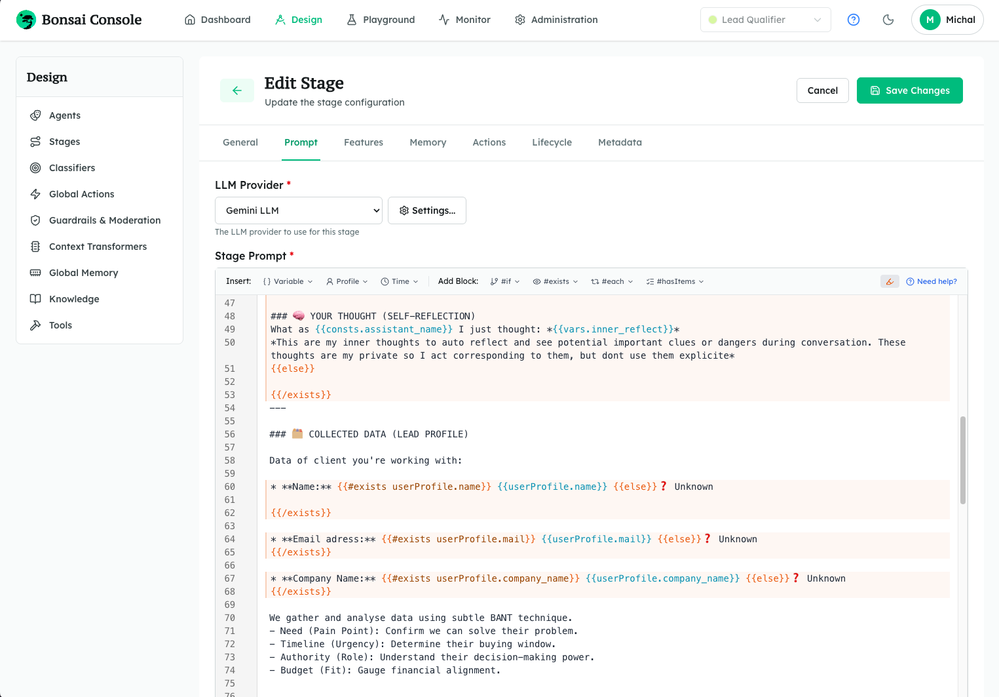
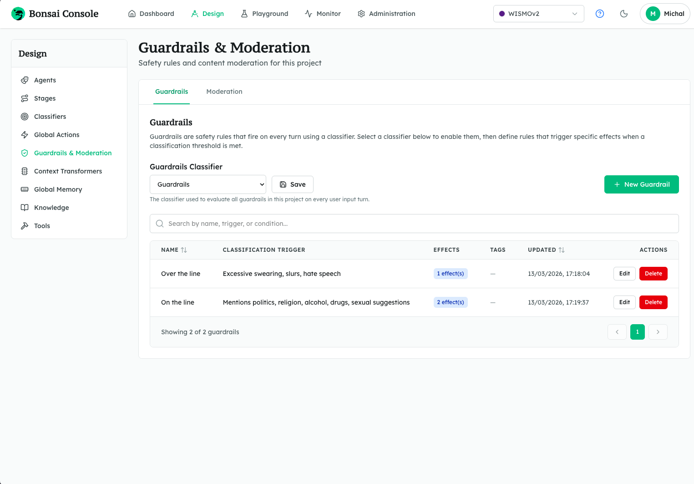
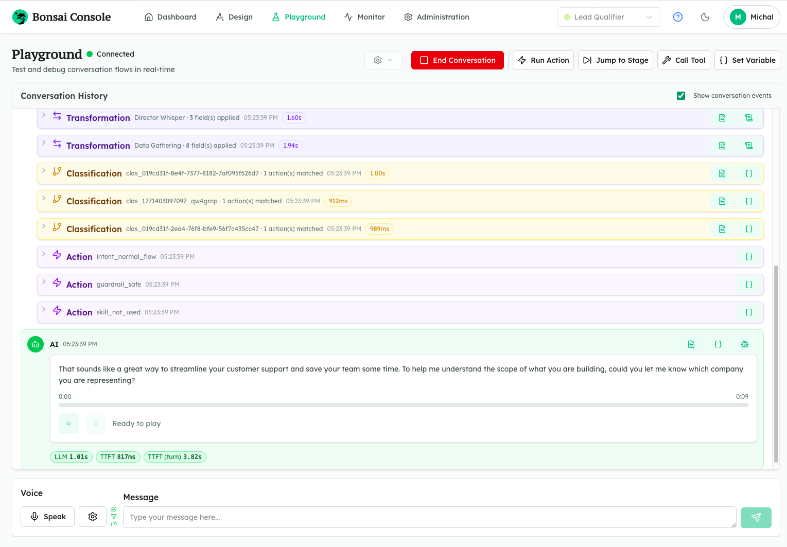
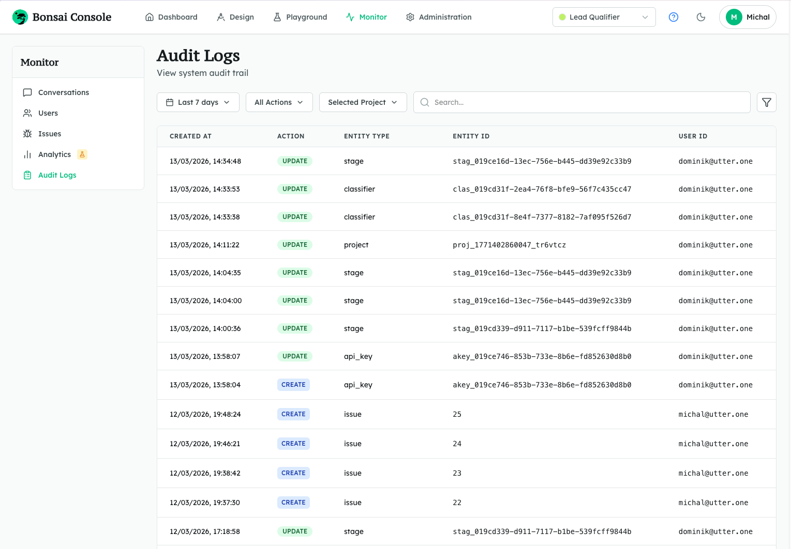

<p align="center">
  <picture>
    <source media="(prefers-color-scheme: dark)" srcset="./docs/assets/bonsai-logo-h-w.svg">
    <source media="(prefers-color-scheme: light)" srcset="./docs/assets/bonsai-logo-h.svg">
    
  </picture>
</p>

Bonsai is a platform for building and operating customer-facing AI agents that must sound like your brand, follow your rules, and stay operable in production.

As a system, Bonsai has two core parts:

- **Bonsai Backend**: the runtime, APIs, orchestration layer, provider integrations, conversation state, guardrails, auditability, and real-time voice/text session engine
- **[Bonsai Console](https://github.com/utter-one/bonsai-console)**: the visual admin panel for designing experiences, monitoring conversations and users, and administering projects, providers, and access

Together they give teams one operating system for conversational AI: design flows and agents, manage knowledge and providers, enforce guardrails and permissions, run live sessions, and monitor what happened in production.

Most AI agent stacks optimize for raw model access. Bonsai optimizes for the full governed system around customer-facing AI: structured stages, explicit actions, approved knowledge, project-wide guardrails, real-time voice and text, and the operational controls brands and enterprises need after launch.

This repository contains the backend half of that system

The companion UI for the full Bonsai platform lives in [Bonsai Console](https://github.com/utter-one/bonsai-console).

## Quick Look

<table>
  <tr>
    <td align="center">
      <a href="./docs/assets/1-bonsai-stage.png">
        
      </a>
      <br>
      <strong>Stage Edit</strong>
    </td>
    <td align="center">
      <a href="./docs/assets/2-bonsai-guardrails.png">
        
      </a>
      <br>
      <strong>Guardrails</strong>
    </td>
  </tr>
  <tr>
    <td align="center">
      <a href="./docs/assets/3-bonsai-playground.png">
        
      </a>
      <br>
      <strong>Playground</strong>
    </td>
    <td align="center">
      <a href="./docs/assets/4-bonsai-audit.png">
        
      </a>
      <br>
      <strong>Audit</strong>
    </td>
  </tr>
</table>


## Quick Start

The fastest way to get Bonsai running locally is through the compose stack

```bash
git clone https://github.com/utter-one/bonsai.git
cd bonsai/compose

cp env.example .env
# Set JWT_SECRET to a random value of at least 32 characters
# Change POSTGRES_PASSWORD before using this outside local development

docker compose up -d
```

Once the stack is up:

- Console admin panel: `http://localhost`
- Backend API: `http://localhost:3000`
- Swagger UI: `http://localhost:3000/api-docs`
- VitePress docs: `http://localhost:8080`

For the full setup details, configuration options,  see [`compose/README.md`](./compose/README.md).

## Who is Bonsai for?

### For brands

Brands do not need a chatbot that "usually behaves". They need an agent that protects tone of voice, respects boundaries, and stays aligned with approved messaging. Bonsai helps with that through:

- structured multi-stage conversations instead of one giant prompt
- reusable agents for personality and voice
- approved FAQ-style knowledge injection
- project-wide guardrails that fire on every stage
- content moderation before the main AI pipeline
- prescripted or generated responses depending on the risk level

### For enterprises

Enterprises need more than generation quality. They need governance, traceability, security, and operational visibility. Bonsai includes:

- JWT-based operator auth plus project-scoped API keys
- RBAC permissions across operators, content, infrastructure, audit, and analytics
- immutable audit logs with before/after snapshots
- issue tracking linked to exact conversations, sessions, stages, and events
- latency analytics and per-conversation timing timelines
- environment records and migration workflows for moving configuration between instances
- optimistic locking on mutable entities to prevent silent overwrites

### For product and engineering teams

Bonsai is headless. You can bring your own frontend, channel, or client application while keeping one backend model for configuration, orchestration, and runtime:

- REST API for administration
- WebSocket API for live voice and text sessions
- generated OpenAPI and JSON Schema contracts
- sandboxed scripts, webhooks, and LLM-powered tools
- provider portability across LLM, ASR, TTS, moderation, and storage

## The Model

Bonsai is built around a project model for conversational applications:

```text
Project  
│  
├── Agents                  ← who speaks (persona, ToV, behavior)  
├── Stages                  ← conversation/runtime states  
│   └── Stage  
│       ├── General         ← basic stage configuration  
│       ├── Prompt          ← stage instructions / prompt template  
│       ├── Features        ← enabled capabilities for this stage  
│       ├── Memory          ← stage-level memory settings  
│       ├── Actions         ← actions available in this stage  
│       ├── Lifecycle       ← transitions, enter/exit behavior  
├── Classifiers             ← input / intent / routing / safety classification  
├── Global Actions          ← actions available across the project  
├── Guardrails & Moderation ← moderation and enforced policies  
├── Context Transformers    ← context shaping / enrichment before inference  
├── Global Memory  
│   ├── User Profile        ← persistent user profile schema  
│   └── Constants           ← project-wide constants  
├── Knowledge               ← approved knowledge, grounding, glossary  
└── Tools                   ← registered callable capabilities (tools for the frontend)

Shared infrastructure
├── Providers
│   ├── LLM
│   ├── TTS
│   ├── ASR
│   └──Storage
└── Environments
```

In practice, that means you can model a conversational experience as explicit stages, attach the right personality and voice to each stage, classify user intent, extract structured context, run effects, call tools or webhooks, and stream the result back over WebSocket.

## How a Turn Works

```text
Voice or text input
  -> ASR (if voice)
  -> Moderation
  -> Classifiers + Guardrails + Context Transformers (in parallel)
  -> Actions and Effects
     - scripts
     - webhooks
     - tools
     - variable updates
     - user profile updates
     - stage navigation
  -> LLM response generation
  -> TTS synthesis (if voice output is enabled)
  -> streamed text and audio back to the client
```

Each conversation stores state, variables, events, artifacts, and timing data, so teams can inspect what happened after the fact instead of treating production as a black box.

## Core Capabilities

- **Structured conversation design**: Build flows with projects, stages, agents, classifiers, transformers, actions, and lifecycle hooks.
- **Real-time voice and text runtime**: Run live sessions over WebSocket with streaming transcription, streamed AI output, and streamed voice.
- **Explicit behavior orchestration**: Use effects such as `go_to_stage`, `run_script`, `call_webhook`, `call_tool`, `modify_variables`, `modify_user_profile`, `generate_response`, `end_conversation`, and `abort_conversation`.
- **Reusable cross-stage behaviors**: Define global actions once and attach them across stages, including lifecycle hooks like `conversation_start` and `conversation_end`.
- **Always-on guardrails**: Enforce project-level safety or policy rules on every stage through a shared guardrail classifier.
- **Content moderation**: Screen user input before the main pipeline and route blocked content through a dedicated moderation hook.
- **Knowledge grounding**: Attach FAQ-style knowledge categories and items to stages using tags, so the model answers from approved material.
- **Context extraction and flow control**: Run LLM-powered context transformers in parallel with classifiers to write typed values into stage state.
- **Voice configuration**: Configure agent-level TTS settings and optional filler responses to reduce perceived latency.
- **Observability and operations**: Track conversations, events, artifacts, issues, audit logs, and latency analytics.
- **Environment promotion**: Preview and pull configuration from remote Bonsai instances into the current one.
- **Schema-first integration**: Generate and expose OpenAPI and WebSocket JSON Schema contracts for tooling and client generation.

## Currently Supported Providers

| Type | Providers |
|---|---|
| `LLM` | OpenAI, OpenAI legacy chat completions, Anthropic, Gemini, Groq, Mistral, DeepSeek, OpenRouter, Together AI, Fireworks AI, Perplexity, Cohere, and xAI |
| `TTS` | ElevenLabs, OpenAI, Azure, Deepgram, Cartesia, and Amazon Polly |
| `ASR` | Azure, ElevenLabs, Deepgram, AssemblyAI, and Speechmatics |
| `Storage` | S3, Azure Blob Storage, Google Cloud Storage, and local filesystem storage |

## API Surfaces

### REST API

The REST API is used for administration and configuration:

- base path: `/api`
- authentication: JWT bearer tokens
- interactive docs: `/api-docs`
- machine-readable schema: `/openapi.json`

Use it to manage projects, stages, agents, classifiers, context transformers, tools, global actions, guardrails, knowledge, providers, users, conversations, issues, environments, migration, audit logs, analytics, and more.

### WebSocket API

The WebSocket API is used for live sessions:

- endpoint: `/ws`
- authentication: project-scoped API key sent in the `auth` message
- schema: `/websocket-contracts.json`

Use it to authenticate sessions, start or resume conversations, stream user voice input, send text input, receive AI text and audio output, inspect conversation events, run actions, call tools, and control stage navigation.

## Documentation

- [Compose quick start](./compose/README.md)
- [Guide](./docs/guide/index.md)
- [API reference](./docs/api/index.md)
- [Contributing](./CONTRIBUTING.md)
- [Security policy](./SECURITY.md)

## Repository Layout

| Path | Purpose |
|---|---|
| `src/` | Application runtime, controllers, services, providers, WebSocket host, and utilities |
| `docs/` | VitePress documentation source for the guide and API reference |
| `compose/` | Fast local stack for backend, console, docs, and PostgreSQL |
| `drizzle/` | Database migrations and schema snapshots |
| `schemas/` | Generated WebSocket JSON Schema contracts |

## Development Scripts

| Command | Description |
|---|---|
| `npm run dev` | Generate WebSocket schema, run migrations, and start the server |
| `npm start` | Run migrations and start the server |
| `npm run build` | Generate WebSocket schema and compile TypeScript |
| `npm run db:generate` | Generate a new Drizzle migration |
| `npm run db:migrate` | Apply pending migrations |
| `npm run db:push` | Push schema changes directly with Drizzle |
| `npm run db:studio` | Open Drizzle Studio |
| `npm run schemas:generate` | Regenerate `schemas/websocket-contracts.json` |

## Tech Stack

- Node.js and TypeScript
- Express for the REST API
- `ws` for real-time WebSocket communication
- PostgreSQL with Drizzle ORM
- Zod for contracts and OpenAPI generation
- `tsyringe` for dependency injection
- `isolated-vm` for sandboxed scripts

## License

Licensed under the [Apache License 2.0](./LICENSE).
