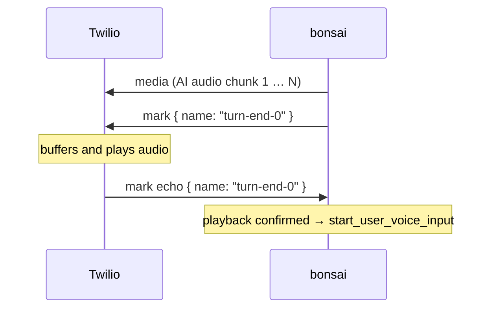
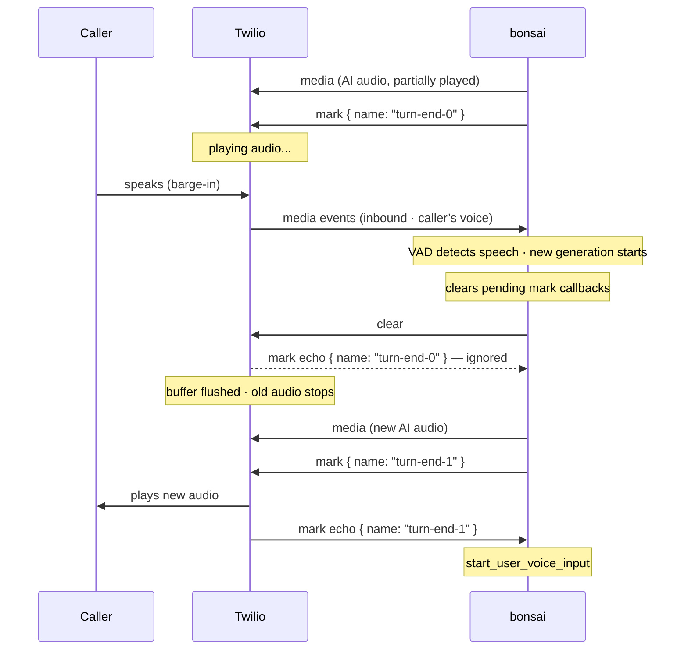

# Twilio Voice API

The Twilio Voice channel handles inbound phone calls via Twilio Media Streams. See the [Twilio Voice Channel](../guide/twilio-voice) guide for setup instructions.

## Endpoints Overview

| Endpoint | Called by | Purpose |
|---|---|---|
| `POST /api/twilio/voice/webhook` | Twilio | Accepts the initial call notification; returns TwiML |
| `WS /api/twilio/voice/stream` | Twilio | Bidirectional µLaw 8 kHz audio stream for the call |

---

## Webhook Endpoint

### POST /api/twilio/voice/webhook

Receives the initial inbound call notification from Twilio. Validates credentials, then returns TwiML instructing Twilio to open a Media Streams WebSocket.

**No standard API authentication** — the request is authenticated by validating the `X-Twilio-Signature` header together with the `apiKey` query parameter.

#### Query Parameters

| Parameter | Required | Description |
|---|---|---|
| `apiKey` | Yes | API key used to identify the project and validate channel/feature permissions |
| `stageId` | Yes | Stage ID to start new conversations at |
| `channelProviderId` | Yes | ID of the `channel` provider record containing Twilio credentials |
| `agentId` | No | Optional agent ID override applied when starting new conversations |

#### Request

Twilio sends an `application/x-www-form-urlencoded` body. Relevant fields:

| Field | Description |
|---|---|
| `From` | Caller's phone number in E.164 format — becomes `userId` for the conversation and is embedded in the stream URL |
| `To` | Your Twilio phone number |
| `CallSid` | Unique call identifier (logged but not used further) |

#### Response

```http
HTTP/1.1 200 OK
Content-Type: text/xml
```

```xml
<?xml version="1.0" encoding="UTF-8"?>
<Response>
  <Connect>
    <Stream url="wss://your-backend.example.com/api/twilio/voice/stream"
            track="inbound_track">
      <Parameter name="apiKey"           value="..."/>
      <Parameter name="stageId"          value="..."/>
      <Parameter name="channelProviderId" value="..."/>
      <Parameter name="from"             value="+15559876543"/>
      <!-- agentId only present when the query param was supplied -->
    </Stream>
  </Connect>
</Response>
```

Credentials are passed as `<Parameter>` child elements rather than URL query parameters. Twilio delivers them in the `start` event's `customParameters` object. This is proxy-safe — reverse proxies commonly strip query strings from WebSocket upgrade requests.

#### Error Responses

| Status | Cause |
|---|---|
| `400 Bad Request` | Missing or invalid query parameters; missing `From` field; provider not found or wrong type; invalid provider config |
| `401 Unauthorized` | API key is missing, unknown, or inactive |
| `403 Forbidden` | `X-Twilio-Signature` validation failed; API key does not permit `twilio_voice` channel |
| `429 Too Many Requests` | IP-based rate limit exceeded |
| `500 Internal Server Error` | Provider config is malformed |

---

## Media Streams WebSocket

### WS /api/twilio/voice/stream

Twilio opens this WebSocket after receiving the TwiML response from the webhook. It carries the entire real-time audio exchange for the call.

**This endpoint is not intended to be called directly.** The URL is generated by the webhook handler and all credentials are delivered in-band via the `start.customParameters` object.

#### Twilio → Server Messages (JSON)

Twilio sends JSON frames over the WebSocket:

**`connected` event** — handshake confirmation, no action taken.

```json
{ "event": "connected", "protocol": "Call", "version": "1.0.0" }
```

**`start` event** — metadata for the stream. Credentials previously set in the TwiML `<Parameter>` elements are delivered here as `customParameters`. The `accountSid` is verified against the provider config.

```json
{
  "event": "start",
  "sequenceNumber": "1",
  "streamSid": "MZxxxxxxxxxxxxxxxxxxxxxxxxxxxxxxxx",
  "start": {
    "streamSid": "MZxxxxxxxxxxxxxxxxxxxxxxxxxxxxxxxx",
    "accountSid": "ACxxxxxxxxxxxxxxxxxxxxxxxxxxxxxxxx",
    "callSid": "CAxxxxxxxxxxxxxxxxxxxxxxxxxxxxxxxx",
    "mediaFormat": { "encoding": "audio/x-mulaw", "sampleRate": 8000, "channels": 1 },
    "customParameters": {
      "apiKey": "...",
      "stageId": "...",
      "channelProviderId": "...",
      "from": "+15559876543"
    }
  }
}
```

On receiving `start`:
1. Credentials from `customParameters` are validated (API key, channel permission, provider lookup, `accountSid` match).
2. A new session is registered with voice settings (`sendAudioFormat: 'mulaw'`, `receiveAudioFormat: 'mulaw'`).
3. `start_conversation` is dispatched with `userId = from` (caller's phone number).
4. `start_user_voice_input` is dispatched; the returned `inputTurnId` is stored for audio routing.

**`media` event** — audio payload from the caller (inbound track only).

```json
{
  "event": "media",
  "sequenceNumber": "2",
  "streamSid": "MZxxxxxxxxxxxxxxxxxxxxxxxxxxxxxxxx",
  "media": {
    "track": "inbound",
    "chunk": "1",
    "timestamp": "5",
    "payload": "<base64 µLaw 8 kHz audio>"
  }
}
```

The base64 payload is decoded and forwarded to `session.runner.receiveUserVoiceData(inputTurnId, buffer)`.

**`stop` event** — call ended; session is unregistered.

```json
{
  "event": "stop",
  "sequenceNumber": "3",
  "streamSid": "MZxxxxxxxxxxxxxxxxxxxxxxxxxxxxxxxx",
  "stop": { "accountSid": "ACxx...", "callSid": "CAxx..." }
}
```

**`mark` event** — echoed by Twilio after previously buffered audio has finished playing (bidirectional streams only). The server uses this to know when it is safe to open the next voice input turn.

```json
{
  "event": "mark",
  "sequenceNumber": "5",
  "streamSid": "MZxxxxxxxxxxxxxxxxxxxxxxxxxxxxxxxx",
  "mark": { "name": "turn-end-0" }
}
```

When a `clear` message was sent, Twilio also echoes back any remaining pending marks. These echoes are **ignored** — the pending callbacks are cleared before `clear` is sent to prevent spurious turn-end signals.

**`dtmf` event** — touch-tone key press detected in the inbound stream (bidirectional streams only). Currently logged only.

```json
{
  "event": "dtmf",
  "sequenceNumber": "4",
  "streamSid": "MZxxxxxxxxxxxxxxxxxxxxxxxxxxxxxxxx",
  "dtmf": { "track": "inbound_track", "digit": "1" }
}
```

#### Server → Twilio Messages (JSON)

The server sends three message types over the WebSocket:

**`media` event** — AI synthesised voice chunk (µLaw 8 kHz).

```json
{
  "event": "media",
  "streamSid": "MZxxxxxxxxxxxxxxxxxxxxxxxxxxxxxxxx",
  "media": { "payload": "<base64 µLaw 8 kHz audio>" }
}
```

Sent for each `send_ai_voice_chunk` CAL message where `audioFormat === 'mulaw'`. Non-µLaw chunks are logged and dropped.

**`mark` event** — sent after the final audio chunk of each AI turn. Twilio echoes the mark back when the buffer drains, signalling that playback is complete and it is safe to open the next voice input turn.

```json
{
  "event": "mark",
  "streamSid": "MZxxxxxxxxxxxxxxxxxxxxxxxxxxxxxxxx",
  "mark": { "name": "turn-end-0" }
}
```

Mark names follow the pattern `bonsai-turn-end-{N}` and are unique per connection.

**`clear` event** — sent at the start of each new AI generation turn to flush any still-buffered audio from the previous turn (barge-in). Clears the pending mark callbacks first so Twilio's flush-echoed marks are ignored.

```json
{
  "event": "clear",
  "streamSid": "MZxxxxxxxxxxxxxxxxxxxxxxxxxxxxxxxx"
}
```

---

## Message Flow Diagrams

### Normal turn — playback synchronisation



### Barge-in — audio interruption



#### WebSocket Close Behaviour

The WebSocket is closed in the following cases:
- `stop` event received from Twilio (call ended normally)
- `accountSid` mismatch on `start` event
- API key validation failure during connection setup
- Underlying socket disconnect

On close the session is unregistered regardless of cause.

---

## Channel Provider Configuration

A channel provider for Twilio Voice uses `providerType: "channel"` and `apiType: "twilio_voice"`. Manage it via the standard [Providers API](./providers).

### Config Schema

```json
{
  "accountSid": "ACxxxxxxxxxxxxxxxxxxxxxxxxxxxxxxxx",
  "authToken": "your_auth_token",
  "phoneNumber": "+15551234567"
}
```

| Field | Type | Description |
|---|---|---|
| `accountSid` | `string` | Twilio Account SID (starts with `AC`) — also verified against the `start` event payload |
| `authToken` | `string` | Twilio Auth Token used for webhook signature validation |
| `phoneNumber` | `string` | Your Twilio phone number in E.164 format |

---

## Webhook URL Structure

Configure this URL in the Twilio console for your phone number (Voice → "A call comes in"):

```
POST https://your-backend.example.com/api/twilio/voice/webhook
  ?apiKey=<api-key-value>
  &stageId=<stage-id>
  &channelProviderId=<provider-id>
  [&agentId=<agent-id>]
```

::: tip
Query parameters are part of the URL used for Twilio request signature validation. Do not modify them after configuring — the signature will break.
:::
