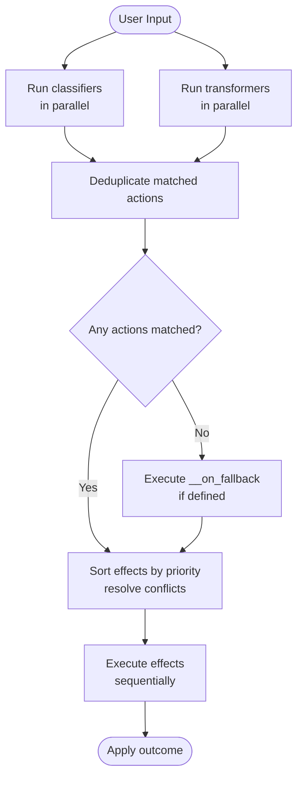

# Actions & Effects

Actions are the primary mechanism for the AI to perform behaviors beyond generating text. Each stage defines a set of actions, and each action contains an ordered list of effects that execute when the action is triggered.

## Action Structure

Each action in the `actions` map has a key (the action ID) and a value with these fields:

| Field | Description |
|---|---|
| `name` | Display name |
| `condition` | Optional JavaScript expression evaluated to determine if the action is active |
| `triggerOnUserInput` | Whether this action can be triggered by user speech/text (default: `true`) |
| `triggerOnClientCommand` | Whether this action can be triggered by a client command |
| `triggerOnTransformation` | Whether this action runs after context transformation |
| `classificationTrigger` | Descriptive label shown to the classifier LLM that tells it when this action should fire; the LLM matches user intent against this label and returns the action **ID** in its response |
| `overrideClassifierId` | Use a specific classifier instead of the stage default |
| `parameters` | Parameters extracted by the classifier when triggering |
| `effects` | Ordered array of effects to execute |
| `examples` | Example user phrases (included in classifier prompt) |
| `watchedVariables` | Map of variable paths to trigger conditions (`new`, `changed`, `removed`, `any`) |
| `metadata` | Arbitrary JSON |

## Stage Lifecycle Actions

Stages support three reserved lifecycle actions with special names (prefixed with `__`):

### `__on_enter`

Runs when the conversation enters this stage — either at the start of a conversation or via a `go_to_stage` effect. Executes **before** the `enterBehavior` (generate response or await input).

Restricted effects: cannot use `end_conversation`, `abort_conversation`, or `go_to_stage`. Calling `goToStage()` inside a `script` tool is also silently ignored.

### `__on_leave`

Runs when the conversation is about to leave this stage (before loading the new stage). Useful for cleanup or persisting state.

Restricted effects: cannot use `go_to_stage` or `generate_response`. Calling `goToStage()` inside a `script` tool is also silently ignored.

### `__on_fallback`

Runs when the classifier found no matching user-triggered action. Acts as the default behavior for unrecognized input. Has no effect restrictions.

## Conversation Lifecycle Actions

In addition to stage-level lifecycle hooks, **global actions** with reserved IDs fire at conversation-level lifecycle events, independent of which stage is active. See [Global Actions — Conversation Lifecycle Hooks](./global-actions#conversation-lifecycle-hooks) for the full reference, restrictions, and use cases.

| Reserved Global Action ID | When it fires |
|---|---|
| `__conversation_start` | Once, after the conversation and first stage are initialised |
| `__conversation_resume` | When a previously-interrupted conversation is resumed |
| `__conversation_end` | When the conversation is gracefully ended |
| `__conversation_abort` | When the conversation is aborted (immediate stop) |
| `__conversation_failed` | When the conversation encounters a fatal error |

There is also a moderation hook:

| Reserved Global Action ID | When it fires |
|---|---|
| `__moderation_blocked` | User input is blocked by content moderation |

See [Global Actions — Content Moderation Hook](./global-actions#content-moderation-hook) for details.

## Trigger Modes

Actions can be triggered in multiple ways:

- **User input** (`triggerOnUserInput: true`) — The classifier analyzes the user's text and matches it to the action's `classificationTrigger`.
- **Client command** (`triggerOnClientCommand: true`) — The client application sends a `run_action` WebSocket command.
- **Transformation** (`triggerOnTransformation: true`) — A context transformer modifies stage variables, and the action's `watchedVariables` matches the change.

## Conditions

The `condition` field accepts a JavaScript expression that evaluates to a boolean. If the condition evaluates to `false`, the action is excluded from the classifier's consideration set. Variables are accessible in conditions:

```javascript
vars.retryCount < 3 && userProfile.tier === 'premium'
```

## Action Parameters

Actions can define parameters that the classifier extracts from user input:

```json
"parameters": [
  {
    "name": "productName",
    "type": "string",
    "description": "The name of the product the user is asking about",
    "required": true
  },
  {
    "name": "quantity",
    "type": "number",
    "description": "How many units",
    "required": false
  }
]
```

Extracted parameters are available in effects via `context.results.actions.<actionId>.<paramName>`.

## Effects

Effects are the building blocks of action behavior. They execute in order within an action.

### `end_conversation`

Gracefully ends the conversation. Optionally generates a final AI response.

```json
{ "type": "end_conversation", "reason": "User's issue has been resolved" }
```

### `abort_conversation`

Immediately ends the conversation without generating any AI response.

```json
{ "type": "abort_conversation", "reason": "Session timeout" }
```

### `go_to_stage`

Navigates to a different stage. Triggers `__on_leave` on the current stage and `__on_enter` on the target stage.

```json
{ "type": "go_to_stage", "stageId": "troubleshooting" }
```

### `modify_user_input`

Replaces the user's input text using a Handlebars template. This modifies what the LLM sees as the user's message.

```json
{
  "type": "modify_user_input",
  "template": "The user wants to know about {{vars.currentTopic}}: {{userInput}}"
}
```

### `modify_variables`

Performs operations on stage variables:

```json
{
  "type": "modify_variables",
  "modifications": [
    { "variableName": "status", "operation": "set", "value": "verified" },
    { "variableName": "retryCount", "operation": "reset" },
    { "variableName": "history", "operation": "add", "value": "step completed" },
    { "variableName": "pendingItems", "operation": "remove", "value": "item-1" }
  ]
}
```

Operations:
- **`set`** — Set a variable to a value
- **`reset`** — Clear a variable
- **`add`** — Append a value to an array
- **`remove`** — Remove a value from an array

### `modify_user_profile`

Same operations as `modify_variables`, but applied to the user's profile instead.

```json
{
  "type": "modify_user_profile",
  "modifications": [
    { "fieldName": "preferredLanguage", "operation": "set", "value": "es" }
  ]
}
```

### `call_tool`

Invokes a tool. The tool's `type` determines its default execution priority relative to other effects (see [Effect Execution Priority](#effect-execution-priority)). An optional `priority` field can override the default (see [Per-Effect Priority Override](#per-effect-priority-override)). See [Tools](./tools).

```json
{
  "type": "call_tool",
  "toolId": "sentiment-analyzer",
  "parameters": { "text": "{{userInput}}" }
}
```

| Field | Description |
|---|---|
| `toolId` | ID of the tool to invoke |
| `parameters` | Handlebars template parameters passed to the tool |
| `asynchronous` | When `true`, the tool runs in the background without blocking the conversation. Results are not stored in context and flow control signals are discarded. Use for fire-and-forget operations (default: `false`) |

Results are stored differently depending on the tool type:
- **`smart_function`** and **`script`** tools — stored under `context.results.tools.<toolId>`
- **`webhook`** tools — stored under `context.results.webhooks.<toolId>`

### `generate_response`

Explicitly triggers AI response generation. Three modes:

**Generated** (LLM produces the response):
```json
{ "type": "generate_response", "responseMode": "generated" }
```

**Prescripted** (predefined text, no LLM call):
```json
{
  "type": "generate_response",
  "responseMode": "prescripted",
  "prescriptedResponses": ["Welcome! How can I help?", "Hi there! What can I do for you?"],
  "prescriptedSelectionStrategy": "random"
}
```
Selection strategies: `random` (pick randomly) or `round_robin` (cycle through).

**Best Match** (LLM chooses the best response from predefined options):
```json
{
  "type": "generate_response",
  "responseMode": "best_match",
  "prescriptedResponses": ["Welcome! How can I help?", "Hi there! What can I do for you?"]
}
```

### `change_visibility`

Sets the visibility of the current turn's messages (both the user input and the AI response). This controls whether those messages are included when building the conversation history sent to the LLM, templates and scripts on future turns.

```json
{
  "type": "change_visibility",
  "visibility": "never"
}
```

| Field | Description |
|---|---|
| `visibility` | `"always"`, `"stage"`, `"never"`, or `"conditional"` (see [Message Visibility](#message-visibility)) |
| `condition` | JavaScript expression evaluated against the conversation context — required when `visibility` is `"conditional"` |

The visibility is recorded on the message event and evaluated when building history on subsequent turns. See [Message Visibility](#message-visibility) for how each value is interpreted.

### `save_artifact`

Saves data from the conversation context to project storage and stores the resulting `artifactId` in a stage variable. The data can be an inline value (string, base64-encoded data, or any JSON-serializable object) or a reference to a variable via Handlebars template syntax.

Typically used in combination with `attach_file` to deliver files to the client.

```json
{
  "type": "save_artifact",
  "data": "{{vars.generatedPdf}}",
  "dataEncoding": "base64",
  "fileName": "invoice.pdf",
  "mimeType": "application/pdf",
  "variableName": "invoiceArtifactId"
}
```

| Field | Required | Description |
|---|---|---|
| `data` | Yes | Data to save: inline value (string, base64, object) or a variable reference (e.g. a Handlebars template resolving a stage variable) |
| `dataEncoding` | No | Encoding of the data: `"raw"` (store as-is, default) or `"base64"` (decode base64 before storing) |
| `fileName` | Yes | Display name for the stored file; supports Handlebars templating |
| `mimeType` | No | MIME type for the stored file. Defaults to `"application/octet-stream"` when omitted |
| `variableName` | Yes | Variable name to store the `artifactId` in (e.g. `"myArtifactId"`) |

The `artifactId` is stored in the specified variable for downstream effects. Requires a storage provider configured on the project. Runs at **priority 8000** by default, after all tool invocations (including scripts), so tool-generated data is available to save. This can be overridden with the `priority` field.

### `attach_file`

Stages a file for delivery alongside the AI response. Must be paired with `generate_response` in the same action — a standalone `attach_file` with no response generation is silently skipped.

The `artifactId` reference typically comes from a preceding `save_artifact` effect or a tool result.

```json
{
  "type": "attach_file",
  "artifactId": "{{vars.invoiceArtifactId}}",
  "fileName": "invoice.pdf",
  "mimeType": "application/pdf"
}
```

| Field | Required | Description |
|---|---|---|
| `artifactId` | Yes | Artifact ID of the file in storage to attach. Supports Handlebars templating to resolve from a stage variable |
| `fileName` | No | Display name for the attachment. Defaults to the artifact's stored name when omitted |
| `mimeType` | No | MIME type override. When omitted, uses the artifact's stored MIME type |

File attachments are delivered to the client as `attach_file_output` messages after text/voice output but before `end_ai_generation_output`. Supported channels: WebSocket, WebRTC, SMTP-IMAP, SendGrid, SES. Runs at **priority 9500** by default, after `save_artifact` (8000), so the artifact ID is guaranteed to be available. This can be overridden with the `priority` field.

`attach_file` is restricted in `__on_leave`, `__conversation_end`, `__conversation_abort`, and `__conversation_failed` lifecycle hooks.

## Effect Execution Priority

Effects from **all** triggered actions are gathered into a single global list, sorted by priority, and then conflict-resolved before execution. Effects within the same priority tier run in the order they appeared across all actions.

| Default Priority | Effect type |
|---|---|
| 1000 | `call_tool` _(webhook tools)_ |
| 2000 | `call_tool` _(smart\_function tools)_ |
| 3000 | `modify_variables` |
| 4000 | `modify_user_profile` |
| 5000 | `modify_user_input` |
| 6000 | `call_tool` _(script tools)_ |
| 7000 | `ban_user` |
| 8000 | `save_artifact` |
| 9000 | `change_visibility` |
| 9500 | `attach_file` |
| 10000 | `generate_response` |
| 11000 | `end_conversation` |
| 12000 | `abort_conversation` |
| 13000 | `go_to_stage` |

`call_tool` effects are assigned a priority at runtime based on the referenced tool's `type`: `webhook` tools run at priority 1000, `smart_function` tools at priority 2000, and `script` tools at priority 6000. `save_artifact` (8000) and `attach_file` (9500) run after all tool types so that tool-generated data is available to save and attach.

### Per-Effect Priority Override

Any effect can carry an optional `priority` field that overrides its default. This lets you reorder effects fine-grained without changing the global defaults. The `priority` is a number — lower values execute first. Defaults are spaced by ~1000 so overrides can slot between built-in tiers.

Example — run a specific tool *after* variables are set (default would be before):

```json
{
  "type": "call_tool",
  "toolId": "my-tool",
  "parameters": { "status": "{{vars.status}}" },
  "priority": 3500
}
```

This places the tool call between `modify_variables` (3000) and `modify_user_profile` (4000), ensuring the variable `status` is already set when the tool runs.

Example — end the conversation immediately, before generating a response:

```json
{
  "type": "end_conversation",
  "reason": "User opted out",
  "priority": 500
}
```

The `execution_plan` conversation event (emitted before any effects run) includes the full effect objects with their resolved priorities, so the actual execution order is always observable.

### Conflict Resolution

- **Multiple `go_to_stage`** — only the first one (lowest priority index) is kept; the rest are discarded
- **`abort_conversation` + `end_conversation`** — `abort_conversation` wins; `end_conversation` is removed
- **Multiple `modify_user_input`** — all are applied in sequence, each receiving the output of the previous
- **Multiple `change_visibility`** — the last one applied wins (highest priority index)

## Execution Flow

When a user sends input, the system runs classifiers and context transformers in parallel, merges results, and executes effects:



Effects within a single action run in order, and their results can be used by subsequent effects. If any effect triggers `end_conversation`, `abort_conversation`, or `go_to_stage`, it takes effect after all current effects complete.

## Message Visibility

Every `message` event (user input and AI response) can carry a `visibility` setting that controls whether it appears in the conversation history sent to the LLM on future turns. Visibility is set by the [`change_visibility`](#change_visibility) effect and evaluated each time history is built.

| Value | Behaviour |
|---|---|
| `always` | Always included in history (default when no visibility is set) |
| `never` | Never included in history |
| `stage` | Included only when the current stage matches the stage the message was recorded in |
| `conditional` | Included only when a JavaScript condition expression evaluates to truthy |

The `conditional` value supports an arbitrary JavaScript expression evaluated against the full conversation context. It can be set via the `change_visibility` effect (using the `condition` field) or directly on the message event data:

```json
{
  "type": "change_visibility",
  "visibility": "conditional",
  "condition": "vars.includeHistory === true"
}
```

Visibility is evaluated lazily: it is recorded on the message event when the turn completes and re-evaluated on every subsequent turn when history is assembled. This means a `stage` or `conditional` message can move in and out of the visible history as the conversation progresses.
