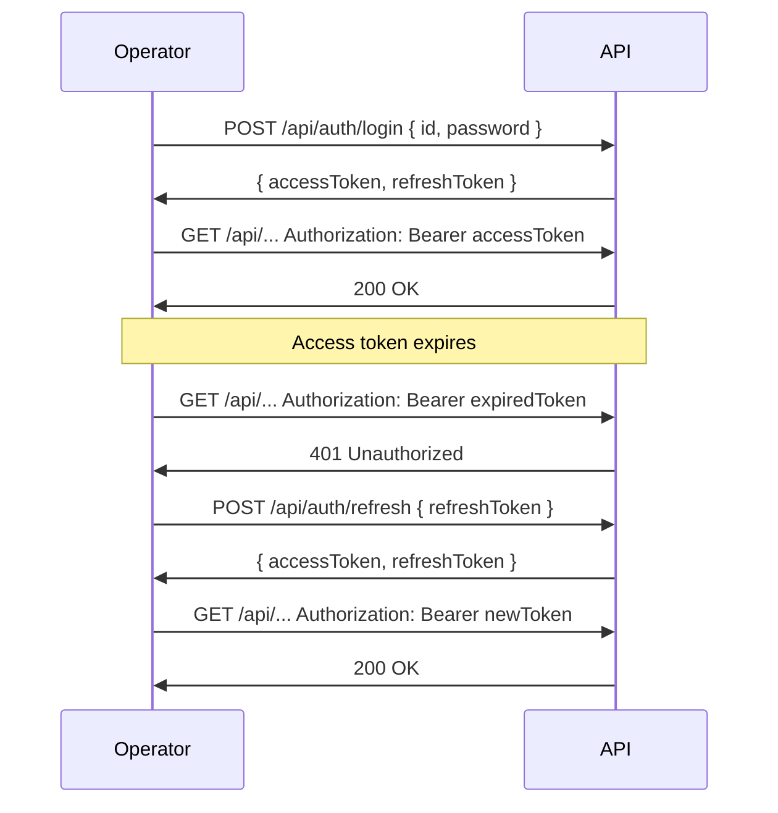
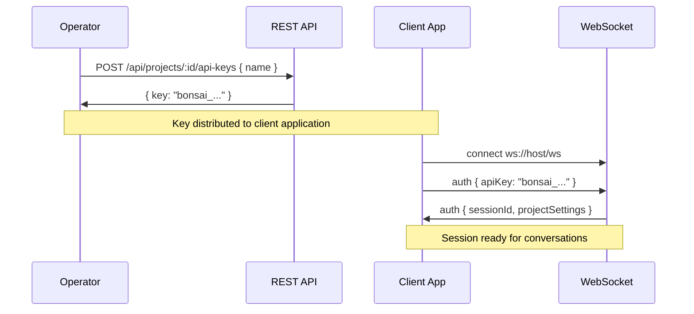

# Authentication & Permissions

Bonsai Backend uses two authentication mechanisms: **JWT tokens** for operator REST API access, and **API keys** for WebSocket conversation sessions.

## Operator Authentication (JWT)

### Login

Operators authenticate by posting credentials to the login endpoint:

```bash
curl -X POST http://localhost:3000/api/auth/login \
  -H "Content-Type: application/json" \
  -d '{ "id": "operator", "password": "your-password" }'
```

The response includes an **access token** and a **refresh token**:

```json
{
  "accessToken": "eyJhbG...",
  "refreshToken": "eyJhbG...",
  "operatorId": "operator",
  "roles": ["super_admin"]
}
```

### Using Tokens

Include the access token in the `Authorization` header:

```
Authorization: Bearer eyJhbG...
```

### Refreshing Tokens

When the access token expires, use the refresh token to obtain a new pair:

```bash
curl -X POST http://localhost:3000/api/auth/refresh \
  -H "Content-Type: application/json" \
  -d '{ "refreshToken": "eyJhbG..." }'
```


```

## Role-Based Access Control (RBAC)

Operators are assigned one or more roles. Each role carries a set of permissions in `entity:action` format.

### Roles

| Role | Description |
|---|---|
| `super_admin` | Full system access — all permissions |
| `content_manager` | Manage content entities: projects, agents, stages, classifiers, transformers, tools, knowledge, providers, API keys |
| `support` | View projects and conversations, manage users and issues |
| `developer` | Read-only access to most entities plus system configuration |
| `viewer` | Read-only access to most entities |

### Permissions

Permissions follow the `entity:action` pattern:

| Entity | Read | Write | Delete |
|---|---|---|---|
| Operator | `operator:read` | `operator:write` | `operator:delete` |
| User | `user:read` | `user:write` | `user:delete` |
| Project | `project:read` | `project:write` | `project:delete` |
| Agent | `agent:read` | `agent:write` | `agent:delete` |
| Stage | `stage:read` | `stage:write` | `stage:delete` |
| Classifier | `classifier:read` | `classifier:write` | `classifier:delete` |
| Context Transformer | `context_transformer:read` | `context_transformer:write` | `context_transformer:delete` |
| Tool | `tool:read` | `tool:write` | `tool:delete` |
| Global Action | `global_action:read` | `global_action:write` | `global_action:delete` |
| Guardrail | `guardrail:read` | `guardrail:write` | `guardrail:delete` |
| Knowledge | `knowledge:read` | `knowledge:write` | `knowledge:delete` |
| Conversation | `conversation:read` | `conversation:write` | `conversation:delete` |
| Issue | `issue:read` | `issue:write` | `issue:delete` |
| Provider | `provider:read` | `provider:write` | `provider:delete` |
| API Key | `api_key:read` | `api_key:write` | `api_key:delete` |
| Environment | `environment:read` | `environment:write` | `environment:delete` |
| Migration | `migration:export` | `migration:import` | — |
| System | `system:config` | — | — |
| Audit | `audit:read` | — | — |
| Analytics | `analytics:read` | — | — |

### Defense in Depth

Security is enforced at two layers:

1. **Controller layer** — `checkPermissions()` validates the request before processing
2. **Service layer** — `requirePermission()` ensures security even when services are called internally

## API Keys {#api-keys}

API keys provide authentication for WebSocket conversation sessions. They are scoped to a project and used by client applications (web apps, mobile apps, kiosks).

### Creating an API Key

```bash
curl -X POST http://localhost:3000/api/projects/my-project/api-keys \
  -H "Authorization: Bearer eyJhbG..." \
  -H "Content-Type: application/json" \
  -d '{ "name": "Production Web App" }'
```

The response includes the **full key** — this is the only time it's shown:

```json
{
  "id": "key-uuid",
  "name": "Production Web App",
  "key": "bonsai_abcdef123456...",
  "keyPreview": "bonsai_abc...456",
  "isActive": true
}
```

### Using API Keys

API keys are used exclusively for WebSocket authentication. The client sends the key in the `auth` message after connecting:

```json
{
  "type": "auth",
  "apiKey": "bonsai_abcdef123456..."
}
```



### Managing API Keys

- **List** — `GET /api/projects/:projectId/api-keys`
- **Deactivate** — Update `isActive` to `false` to disable without deleting
- **Delete** — `DELETE /api/projects/:projectId/api-keys/:id`

Deactivated keys are immediately rejected on WebSocket authentication attempts.

## Initial Setup

When the system has no operator accounts, the setup endpoint is available:

```bash
POST /api/setup/initial-operator
```

This creates the first super operator account. The endpoint is disabled after the first operator is created.

## Audit Logs

All write operations are recorded in the audit log with:

- Who performed the action (`userId`)
- What action was taken (`action`)
- Which entity was affected (`entityId`, `entityType`)
- Previous state (`oldEntity`) and new state (`newEntity`)
- Timestamp

Audit logs are read-only and accessible to users with the `audit:read` permission.
