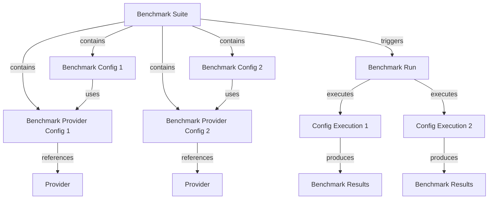

# Benchmark

**Benchmark** is a system for running performance tests against LLM, TTS, and ASR providers. It executes test cases multiple times, collects timing statistics, and produces aggregated metrics (average, percentiles, min/max).

## How It Works

You define reusable **Provider Configs** and **Configs** grouped into a **Suite**. The system executes the suite manually or on a cron schedule, producing **Runs** with per-iteration results.

## Benchmark Suite

A **Suite** is the top-level container that groups multiple test configurations. It can be scheduled via cron for recurring benchmarks.

| Field | Description |
|---|---|
| `id` | Unique suite identifier |
| `name` | Display name |
| `description` | Optional description |
| `cronExpression` | Node-cron schedule (e.g. `"0 * * * *"` for hourly). `null` disables scheduling |
| `isActive` | Whether scheduled runs are enabled |
| `tags` | Tags for filtering |
| `createdBy` | Operator who created the suite |

## Benchmark Provider Config

A **Provider Config** is a reusable snapshot of a provider (LLM, TTS, or ASR) plus its settings. Shared across suites and configs.

| Field | Description |
|---|---|
| `id` | Unique config identifier |
| `name` | Display name |
| `providerType` | `llm`, `tts`, or `asr` |
| `providerId` | ID of the provider entity |
| `settings` | Provider-specific settings (model, voice, language, etc.) |
| `providerSettings` | Additional per-config overrides (e.g. TTS `model`, `voiceId`, `audioFormat`, `speed`) |

## Benchmark Config

A **Config** is a single test case linking a suite to a provider config with typed input data. Each config is repeated N times per run.

| Field | Description |
|---|---|
| `id` | Unique config identifier |
| `suiteId` | Parent suite |
| `name` | Display name |
| `description` | Optional description |
| `providerConfigId` | Provider config to test |
| `inputType` | `messages` (LLM), `text` (TTS), or `audio` (ASR) |
| `inputData` | Typed input: LLM: `{messages: LlmMessage[]}`, TTS: `{text: string}`, ASR: `{audioBase64, mimeType, fileName?}` |
| `repeats` | Number of iterations per run (1-100, default 3) |

## Benchmark Run

A **Run** is one execution of a full suite. Contains config executions, each with multiple iteration results.

| Field | Description |
|---|---|
| `id` | Unique run identifier |
| `suiteId` | Suite that was executed |
| `trigger` | `manual` or `scheduled` |
| `status` | `pending`, `in_progress`, `completed`, or `failed` |
| `startedAt` | Execution start time |
| `completedAt` | Execution end time |
| `error` | Error message (if failed) |

### Benchmark Stats

Each config execution produces aggregated statistics:

| Field | Description |
|---|---|
| `totalDurationMs` | TimingStats: avg, p50, p95, p99, min, max |
| `timeToFirstChunkMs` | Time to first chunk (null if not applicable) |
| `chunkIntervalMs` | Interval between chunks (null if not applicable) |
| `successRate` | 0.0-1.0 success ratio |
| `completedIterations` | Number of successful iterations |
| `failedIterations` | Number of failed iterations |

## Background Execution

The `BenchmarkExecutorService` starts at server boot and:

1. Polls every 30 seconds for pending runs
2. Processes one run at a time (sequential)
3. Resets stuck `in_progress` runs to `pending` on startup
4. Registers cron-scheduled suites that fire automatically

Three runner classes handle execution: `LlmBenchmarkRunner`, `TtsBenchmarkRunner`, `AsrBenchmarkRunner`.

## Common Operations

**Suites**
- Create: `POST /api/benchmarks/suites`
- List: `GET /api/benchmarks/suites`
- Get: `GET /api/benchmarks/suites/:id`
- Update: `PUT /api/benchmarks/suites/:id`
- Delete: `DELETE /api/benchmarks/suites/:id`
- List Configs: `GET /api/benchmarks/suites/:id/configs`

**Provider Configs**
- Create: `POST /api/benchmarks/provider-configs`
- List: `GET /api/benchmarks/provider-configs`
- Get: `GET /api/benchmarks/provider-configs/:id`
- Update: `PUT /api/benchmarks/provider-configs/:id`
- Delete: `DELETE /api/benchmarks/provider-configs/:id`

**Configs**
- Create: `POST /api/benchmarks/configs`
- Get: `GET /api/benchmarks/configs/:id`
- Update: `PUT /api/benchmarks/configs/:id`
- Delete: `DELETE /api/benchmarks/configs/:id`

**Runs**
- Trigger: `POST /api/benchmarks/runs`
- List: `GET /api/benchmarks/runs`
- Get: `GET /api/benchmarks/runs/:id`
- Delete: `DELETE /api/benchmarks/runs/:id`
- Results: `GET /api/benchmarks/executions/:id/results`

All endpoints require `benchmark:read`, `benchmark:write`, or `benchmark:run` permission.

## References

- [Providers](./providers) — Provider configuration for LLM, TTS, ASR
