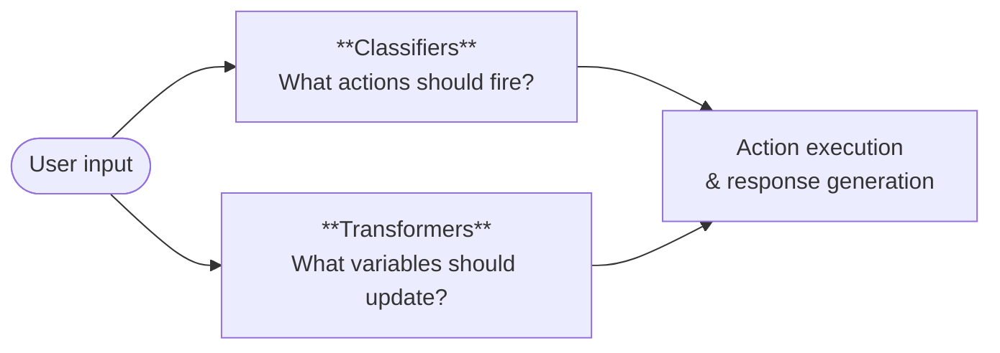
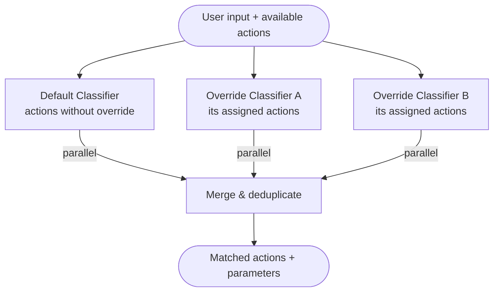
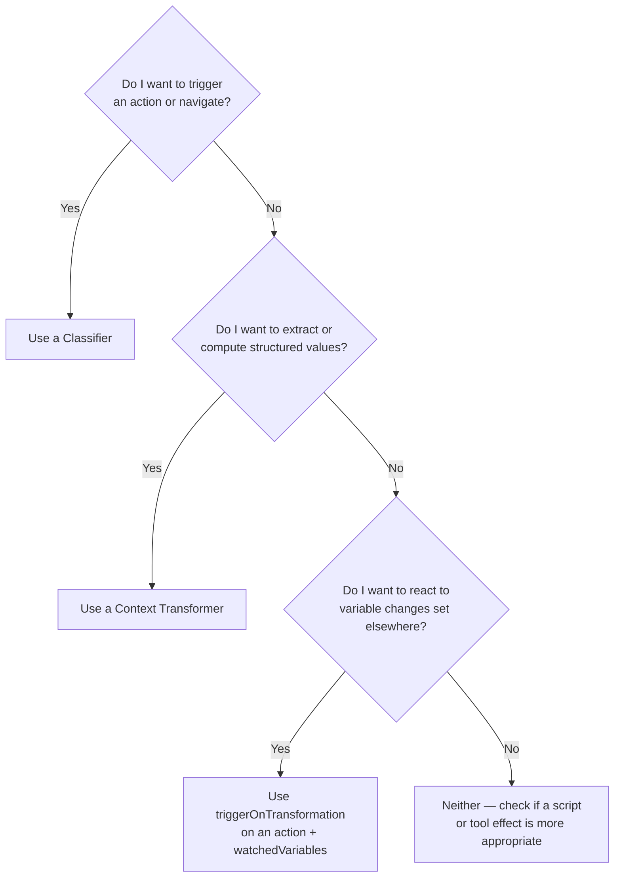

# Classifiers & Transformers Guide

Classifiers and context transformers are the two LLM-powered components that run on every user input turn. They execute **in parallel**, each with a distinct role: classifiers decide *what to do*, transformers decide *what to know*.

This guide explains both concepts, when to use each, and how to apply them effectively in practice.

## The Dual Pipeline

When a user sends a message, the platform splits processing into two concurrent tracks before either result is used:



Because both tracks run in parallel, adding transformers to a stage does not add sequential latency to the turn — the user experiences only the cost of the slower of the two tracks.

## Classifiers

A classifier answers the question: **"Which actions does this user input trigger?"**

Given the user's message and the list of currently-available actions for the stage, the classifier LLM returns the IDs of matched actions and any extracted action parameters. This drives all of the conversation's branching, navigation, and reactive behaviors.

### When to use a classifier

Use a classifier whenever the conversation needs to **react to user intent**. Typical signals:

- Routing users between stages (`go_to_stage` effects)
- Triggering tool calls based on what the user asks
- Confirming or cancelling pending operations
- Detecting topic shifts, opt-outs, or special commands
- Applying knowledge base FAQ results based on the subject of the question
- Enforcing guardrail rules across the project

A stage **must** have a `defaultClassifierId` for any user-triggered actions to fire. If no classifier is configured, the stage's `__on_fallback` lifecycle action runs on every turn.

### What classifiers see

The classifier prompt template receives the full conversation context plus one extra variable:

| Variable | Description |
|---|---|
| `stage.availableActions` | Actions whose `condition` evaluated to truthy for this turn |
| `userInput` | The current user message |

The list of available actions is pre-filtered: actions with falsy `condition` expressions are already excluded before the classifier runs.

Each action in `stage.availableActions` exposes its `id`, `name`, `trigger` label (the `classificationTrigger` field), `examples`, and `parameters`. The classifier's job is to return the **action IDs** that match.

### Required output format

```json
{
  "actions": {
    "<actionId>": { "paramName": "paramValue" },
    "<anotherActionId>": {}
  }
}
```

Actions not matched must be omitted entirely.

### Structuring the classifier prompt

A well-structured classifier prompt has three parts:

**1. Role and task description**

```handlebars
You are a classification assistant. Analyze the user's message and determine which of the
available actions should fire. Return only action IDs that genuinely match.
```

**2. The available actions list**

```handlebars
Available actions:
{{#each stage.availableActions}}
- ID: {{id}} | Trigger: {{trigger}}
  {{#if examples}}Examples: {{join examples ", "}}{{/if}}
  {{#if parameters}}
  Parameters:
  {{#each parameters}}  - {{name}} ({{type}}){{#if required}} *required*{{/if}}: {{description}}{{/each}}
  {{/if}}
{{/each}}
```

**3. Extraction rules and output format instructions**

Tell the model exactly what JSON shape to return, what to do when nothing matches, and how to handle parameter types.

### Multiple classifiers on one stage

By default every action in a stage uses the stage's `defaultClassifierId`. Individual actions can set `overrideClassifierId` to use a different classifier. This is useful when:

- Different subsets of actions need different classification strategies (e.g., precise keyword matching vs. semantic intent matching)
- You want to isolate noisy or experimental actions from the main classification model
- A specific action needs a more powerful or specialized model

All classifiers for a stage run in parallel; their results are merged and deduplicated before action execution begins.



---

## Context Transformers

A context transformer answers the question: **"What structured information should be extracted or computed from this turn?"**

The transformer's LLM prompt reads the conversation context and writes values into the stage's variable store. Those variables persist for the rest of the conversation and are immediately available in templates, conditions, and scripts.

### When to use a transformer

Use a transformer whenever you need to **maintain structured state** that is derived from natural language. Typical signals:

- You need to progressively fill in a "form" over multiple turns (name, email, order number…)
- You want to classify the topic or sentiment continuously across turns rather than as a one-time action
- The stage prompt includes a conditional block that depends on a value the user might mention at any point
- You want to pre-compute a text fragment and inject it into the stage system prompt via a variable
- You need to set a boolean flag that will later enable or disable an action's `condition`
- You want to silently append instructions to the LLM's system context ("whisper") based on what the user said

A transformer does **not** fire actions directly. It only writes to the variable store. Actions that should react to variable changes use `triggerOnTransformation: true` with `watchedVariables` to bridge the gap.

### Configuring context fields

The `contextFields` array declares which variable names the transformer is allowed to write. Any keys the LLM returns that are not in this list are silently discarded. This prevents prompt injection or unexpected state writes.

```json
["customerName", "orderNumber", "issueType", "sentimentScore"]
```

These names must match the field names in the stage's `variableDescriptors`. The type information from the descriptors is what populates the <code v-pre>{{schema}}</code> template variable.

### Structuring the transformer prompt

A minimal, effective extraction prompt:

```
Extract the following information from the conversation. Only include fields that are
explicitly stated or clearly implied. Return null for anything not mentioned.

Return a JSON object matching this schema:
{{schema}}

Current values (only update fields that changed):
{{json context}}
```

The two template variables are critical:

- <code v-pre>{{schema}}</code> — Provides the exact field names and types the LLM should output. Always include it so the model produces the right shape.
- <code v-pre>{{json context}}</code> — Shows existing values. Prevents the model from re-extracting things already known and signals which fields still need to be filled.

Add `{{userInput}}` when the current message is the primary source of extraction. Add `{{history}}` if you need the model to reason over the full conversation to infer values.

### How variables are merged

Transformer output is **merged** into the existing variable store, not replaced. If the LLM returns only two out of five declared fields, the other three keep their current values. Only a field explicitly set to `null` will clear an existing value.

This means transformers are naturally additive: multiple turns progressively fill in the state, and earlier information is not lost just because the LLM doesn't mention it again.

### Triggering actions from transformer output

Transformers can indirectly fire actions by changing variables that actions watch:

```json
{
  "triggerOnTransformation": true,
  "watchedVariables": {
    "issueType": "new",
    "escalationRequired": "any"
  }
}
```

Trigger conditions:

| Condition | Meaning |
|---|---|
| `new` | Variable had no value, now has one |
| `changed` | Variable's value is different from the previous turn |
| `removed` | Variable was set to `null` |
| `any` | Any of the above: creation, change, or removal |

When both a `watchedVariables` condition is met **and** the action's optional `condition` expression passes, the action fires alongside any classifier-triggered actions in the same turn.

---

## Choosing Between Classifiers and Transformers

| Question | Classifier | Transformer |
|---|---|---|
| Should this trigger an action or navigation? | ✓ | — |
| Should this extract structured data from natural language? | — | ✓ |
| Does this need to fire immediately (before response generation)? | ✓ | ✓ (both run before response) |
| Does the value need to persist across multiple turns? | — | ✓ |
| Does the behavior depend on the full list of actions available? | ✓ | — |
| Does the behavior depend on previously-extracted state? | — | ✓ |
| Can multiple things be true simultaneously in one turn? | ✓ (multiple actions) | ✓ (multiple fields) |

**In practice:** classifiers and transformers work best together. The classifier handles intent and routing; the transformer handles data collection. Most non-trivial stages need both.

### Decision guide



---

## Configuration Reference

### Attaching to a stage

```json
{
  "defaultClassifierId": "clf_main",
  "transformerIds": ["xfm_collect_info", "xfm_sentiment"]
}
```

Multiple transformers run in parallel; their results are applied sequentially in array order when conflicts occur (last writer wins for the same field).

### LLM provider and settings

Both classifiers and transformers require their own `llmProviderId` and `llmSettings`. They are independent from the stage's completion LLM, allowing you to use:

- A **fast, cheap model** for classification (low output tokens, deterministic)
- A **capable model** for complex extraction (structured reasoning)
- A **different provider** entirely if cost or latency targets differ

For classification, set a low `temperature` (0–0.2) and disable streaming if the provider supports it. For extraction, slightly higher temperature (0.2–0.4) can improve recall on ambiguous input.

---

## Common Patterns

### Progressive form filling

Use a single transformer to extract all fields of a "form" over many turns. The user can provide information in any order:

```
contextFields: ["name", "email", "accountNumber", "issueDescription"]
```

Reference collected values in the stage prompt:

```handlebars
{{#if vars.name}}Customer name: {{vars.name}}{{/if}}
{{#if vars.accountNumber}}Account: {{vars.accountNumber}}{{/if}}
{{#unless vars.accountNumber}}Ask for the account number before proceeding.{{/unless}}
```

### Whisper injection

Use a transformer to write a short instruction into a variable, then reference it in the system prompt. The instruction is invisible to the user but steers the LLM's next response:

```
contextFields: ["nextResponseInstruction"]
```

Prompt instructs the LLM to produce something like:
```
"Make sure to offer the premium upgrade option in your next response."
```

Stage prompt includes:
```handlebars
{{#if vars.nextResponseInstruction}}
[Internal guidance: {{vars.nextResponseInstruction}}]
{{/if}}
```

### Sentiment-driven escalation

A transformer continuously updates a `sentimentScore` field (e.g., `negative`, `neutral`, `positive`). An action watches for the score to change to `negative`:

```json
{
  "triggerOnTransformation": true,
  "watchedVariables": { "sentimentScore": "any" },
  "condition": "vars.sentimentScore === 'negative' && vars.escalationOffered !== true"
}
```

When triggered, the action sets `escalationOffered` to `true` and generates a response offering to escalate.

### Classifier-gated navigation

A stage handles troubleshooting. When the user says they're done, the classifier fires a `resolve_issue` action that navigates to the resolution stage. All the context collected by the transformer (`issueType`, `steps_tried`, etc.) is already in the variable store and accessible in the new stage because stage variables are stored per-stage on the conversation.

### Knowledge-augmented classification

When `useKnowledge: true` is set on the stage, knowledge categories matching the stage's `knowledgeTags` are injected as synthetic actions into the classifier's consideration set. The classifier can then match a user question to a knowledge category, and the relevant FAQ items are included in the response generation context via <code v-pre>{{faq}}</code> in the stage prompt.

---

## Prompt Writing Tips

### Classifiers

- **List every action explicitly.** The model cannot match what it cannot see. Always iterate over `stage.availableActions`.
- **Use clear trigger labels.** The `classificationTrigger` field on each action is shown to the classifier as "when to fire this action." Make it a specific, unambiguous label.
- **Provide examples.** Actions with the `examples` array give the classifier concrete phrases to match against.
- **Specify the output format strictly.** Include the expected JSON structure in the prompt. Require an empty `actions` object (not null or a list) when nothing matches.
- **Avoid multi-action confusion.** If many actions have similar triggers, increase specificity in their `classificationTrigger` labels or consider splitting them across different classifiers with `overrideClassifierId`.

### Transformers

- **Always include <code v-pre>{{schema}}</code>.** Without it, the model will guess field names and types.
- **Always include <code v-pre>{{json context}}</code>.** Without it, the model re-extracts the same data every turn instead of being incremental.
- **Instruct the model to return `null` for missing fields.** This distinguishes "not mentioned" from "not extracted" and prevents stale values from being overwritten.
- **Declare only the fields you need.** Every field in `contextFields` is presented to the LLM as something to look for. Too many fields dilute attention and increase cost.
- **Use specific field names.** `orderNumber` is clearer than `number`. `sentimentLabel` is clearer than `sentiment`.
- **Keep extraction focused.** If a transformer is extracting more than 6–8 fields, consider splitting it into two transformers on separate concerns. They run in parallel and each keeps a tighter focus.

---

## See Also

- [Classifiers](./classifiers) — Full field reference and output format details
- [Context Transformers](./context-transformers) — Full field reference and `watchedVariables` details
- [Stages](./stages) — How to attach classifiers and transformers to a stage
- [Actions & Effects](./actions-and-effects) — Trigger modes, conditions, and effect types
- [Guardrails](./guardrails) — Project-wide classifier-driven safety rules
- [Templating](./templating) — Full list of Handlebars template variables
