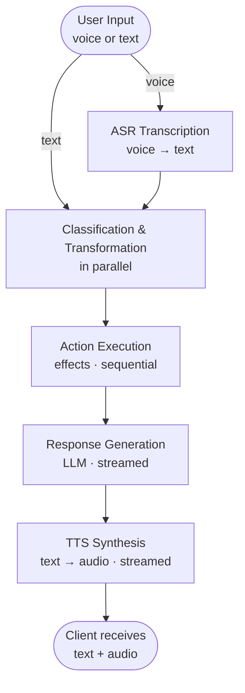

# Core Concepts

This page provides an architectural overview of Bonsai Backend and explains how its entities relate to each other.

## Architecture

Bonsai Backend is built on:

- **Express** — HTTP REST API server with Swagger UI documentation
- **WebSocket (ws)** — Real-time bidirectional communication for live conversations
- **PostgreSQL + Drizzle ORM** — Persistent storage with type-safe queries and migrations
- **tsyringe** — Dependency injection / IoC container
- **Zod** — Schema validation, type inference, and OpenAPI documentation source of truth

## Entity Hierarchy

Everything in Bonsai Backend revolves around **Projects**. A project is a self-contained conversational AI experience. Here is the full entity hierarchy:

```
Project
├── Stages (conversation phases)
│   ├── → Agent (AI personality + voice)
│   ├── → LLM Provider (for response generation)
│   ├── → Default Classifier (intent detection)
│   ├── → Context Transformers[] (variable population, prompt fragments, flow control)
│   ├── → Global Actions[] (reusable behaviors)
│   ├── → Knowledge tags (FAQ injection)
│   ├── Variable Descriptors (stage data schema)
│   └── Actions (triggered behaviors with effects)
│
├── Agents (AI personality definitions)
│   ├── Prompt (system behavior)
│   └── TTS Settings (voice configuration)
│
├── Classifiers (LLM intent classifiers)
├── Context Transformers (LLM-powered variable population)
├── Tools (LLM-callable operations)
├── Knowledge Categories → Items (FAQ)
├── Global Actions (reusable action definitions)
├── Guardrails (content safety classifiers)
├── API Keys (WebSocket authentication)
│
├── Conversations → Events → Artifacts
└── Users (end-user profiles)

Providers (shared, not project-scoped)
├── LLM (OpenAI, Anthropic, Gemini, Azure)
├── TTS (ElevenLabs, OpenAI, Deepgram, Cartesia, Azure)
├── ASR (Azure, ElevenLabs, Deepgram)
└── Storage (S3, Azure Blob, GCS, Local)

Environments (shared, not project-scoped)
└── Key-value variable overrides per deployment context
```

## Conversation Flow

A typical conversation turn follows this pipeline:



Each step streams results incrementally to the client via WebSocket, providing low-latency responses.

## Key Concepts

### Stages as Conversation Phases

Stages represent distinct phases in a conversation. A customer service bot might have stages like "greeting", "identify_issue", "troubleshooting", and "resolution". Each stage has its own:

- System prompt (Handlebars template)
- Agent (AI personality and voice)
- Available actions and their effects
- Variable schema for structured data
- Classifier for intent detection
- Knowledge tags for FAQ injection

The conversation can move between stages via the `go_to_stage` effect.

### Actions as Behaviors

Actions are the primary mechanism for the AI to "do things" beyond generating text. They consist of a classification trigger (how user input maps to the action) and a list of effects (what happens when triggered). See [Actions & Effects](./actions-and-effects) for details.

### Providers as External Integrations

Providers abstract external AI services. A single provider entry (e.g., "OpenAI GPT-4o") can be referenced by multiple stages, classifiers, transformers, and tools. This makes it easy to swap models or services without modifying conversation logic.

### Knowledge as Dynamic Context

Knowledge categories contain FAQ-style question-answer pairs. When a stage has `useKnowledge` enabled, relevant knowledge categories are automatically included in the classifier's consideration set, allowing the AI to answer FAQ-type questions without explicit action definitions.

### Optimistic Locking

All mutable entities use a `version` field for optimistic concurrency control. Update and delete operations must include the current version number, ensuring no silent overwrites when multiple operators edit simultaneously.

## APIs

Bonsai Backend exposes a REST API for administration and a WebSocket API for live conversations, along with unauthenticated schema endpoints for tooling and client generation. See the [APIs](./apis) page for the full overview.
