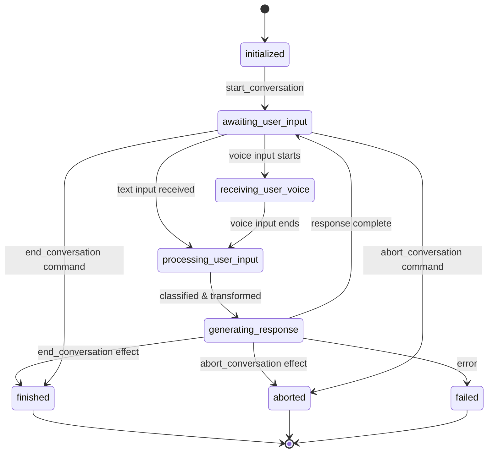

# Conversations

A **Conversation** represents a real-time session between an end user and the AI. Conversations track state, variables, events, and artifacts throughout their lifecycle.

## Structure

| Field | Description |
|---|---|
| `id` | Conversation identifier |
| `projectId` | Parent project |
| `userId` | End user ID |
| `clientId` | Client application identifier |
| `stageId` | Current stage the conversation is in |
| `stageVars` | Stage variables (map of stage ID → variables) |
| `status` | Current conversation state |
| `statusDetails` | Optional reason for the current status |
| `metadata` | Arbitrary JSON |

## Conversation States

Conversations follow this state machine:



| State | Description |
|---|---|
| `initialized` | Conversation created but not yet started |
| `awaiting_user_input` | Waiting for user to speak or type |
| `receiving_user_voice` | User is actively streaming voice audio |
| `processing_user_input` | Classifying and processing user input |
| `generating_response` | LLM is generating a response |
| `finished` | Conversation ended gracefully |
| `aborted` | Conversation ended abruptly |
| `failed` | Conversation ended due to an error |

## Conversation Events

Every significant occurrence during a conversation is recorded as an event:

| Event Type | Description |
|---|---|
| `conversation_start` | Conversation started (stageId, initial variables) |
| `conversation_resume` | Conversation resumed from a previous session |
| `conversation_end` | Conversation ended gracefully (reason, stageId) |
| `conversation_aborted` | Conversation aborted (reason, stageId) |
| `conversation_failed` | Conversation failed (reason, stageId) |
| `message` | User or AI message (role, text, original text, LLM usage, optional visibility) |
| `classification` | Classifier result (classifierId, matched actions, parameters) |
| `transformation` | Transformer result (transformerId, applied fields) |
| `action` | Action executed (action name, stageId, effects) |
| `command` | Client command received (command type, parameters) |
| `tool_call` | Tool invoked (toolId, parameters, result, success/error) |
| `jump_to_stage` | Stage navigation (fromStageId, toStageId) |

Events provide a full audit trail of the conversation for debugging, analytics, and compliance.

### Message Visibility

`message` events carry an optional `visibility` field that controls whether the message is included in the conversation history sent to the LLM on subsequent turns. When no visibility is set, messages are always included.

| Value | Behaviour |
|---|---|
| `always` | Always included in history (default) |
| `never` | Never included in history |
| `stage` | Included only while the conversation is in the same stage where the message was recorded |
| `conditional` | Included only when a JavaScript expression evaluates to truthy |

Visibility is set by the [`change_visibility`](./actions-and-effects.md#change_visibility) effect, which applies to both the user input and the AI response for the current turn. See [Message Visibility](./actions-and-effects.md#message-visibility) in the actions guide for full details and examples.

### Timing Metadata

Select event types include a `metadata` object with timing measurements (all values in milliseconds). These are useful for latency analysis and performance monitoring.

**User `message` event**

| Field | Description |
|-------|-------------|
| `processingDurationMs` | Time from turn start to LLM invocation (classification + transformation) |
| `actionsDurationMs` | Time spent executing actions during input processing |
| `fillerDurationMs` | Time to generate the filler sentence (`null` if unused) |

**Assistant `message` event**

| Field | Description |
|-------|-------------|
| `llmDurationMs` | Time from first token to generation completion |
| `timeToFirstTokenMs` | Time from LLM invocation to the first token |
| `timeToFirstTokenFromTurnStartMs` | Time from turn start to the first token (includes classification, transformation, and actions) |
| `timeToFirstAudioMs` | Time from turn start to the first TTS audio chunk (voice turns only) |
| `totalTurnDurationMs` | Full turn duration from turn start to TTS completion (back-filled after TTS finishes on voice turns) |

**`classification` and `transformation` events** include `durationMs` — the time taken to run the respective classifier or transformer.

**`tool_call` events** include `durationMs` — the time taken to execute the tool.

## Stage Variables

Conversations maintain variables scoped to each stage. The `stageVars` field is a nested map:

```json
{
  "greeting-stage": {
    "customerName": "Alice",
    "tier": "premium"
  },
  "troubleshooting-stage": {
    "issueType": "billing",
    "resolved": false
  }
}
```

When navigating between stages, each stage's variables are preserved separately, so returning to a previous stage restores its state.

## Lifecycle

1. **Start** — Client sends `start_conversation` with `userId` and starting `stageId`
2. **Input loop** — User sends voice or text, system processes and responds
3. **Stage navigation** — Conversation moves between stages via `go_to_stage` effects
4. **Resume** — A previously started conversation can be resumed with `resume_conversation`
5. **End** — Conversation ends via:
   - `end_conversation` effect (graceful)
   - `abort_conversation` effect (immediate)
   - Inactivity timeout (see below)
   - Client disconnect
   - Error (failed state)

See [WebSocket Protocol](./websocket) for the complete message flow.

## Inactivity Timeout

If the project has `conversationTimeoutSeconds` configured, conversations that remain in an active state without any new events for longer than the configured period are automatically aborted.

A background job runs every minute and checks all active conversations (`initialized`, `awaiting_user_input`, `receiving_user_voice`, `processing_user_input`, `generating_response`). Any conversation whose last event timestamp (or `updatedAt` if no events exist) is older than the configured threshold is aborted.

The connected client receives a `conversation_aborted` WebSocket event with the reason `"Conversation timed out due to inactivity"`.

See [Projects — Conversation Timeout](./projects#conversation-timeout) for configuration details.
