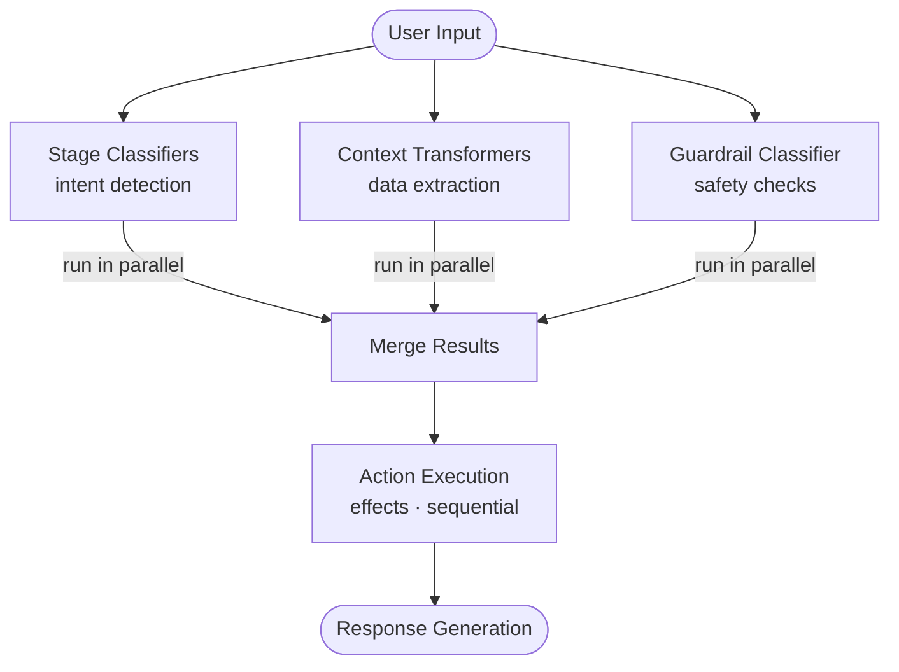

# Guardrails

**Guardrails** are project-level safety and behavioral rules that fire on **every stage** of a conversation, regardless of stage configuration. Unlike [Global Actions](./global-actions), which must be explicitly enabled per stage, guardrails are always active and cannot be suppressed by individual stages.

## How Guardrails Work

Each guardrail is evaluated through a **shared project-level classifier** (set via `defaultGuardrailClassifierId` on the project). On every user input turn, the guardrail classifier runs in **parallel** with the stage's own classifiers and context transformers — it does not add sequential latency to the pipeline.

When the classifier matches a guardrail's `classificationTrigger`, its effects are executed immediately as part of that turn's action processing.

If no `defaultGuardrailClassifierId` is configured on the project, all guardrails are skipped.

## Structure

| Field | Type | Required | Description |
|-------|------|----------|-------------|
| `id` | `string` | No | Unique identifier (auto-generated if omitted) |
| `projectId` | `string` | — | Parent project (set automatically) |
| `name` | `string` | Yes | Display name |
| `condition` | `string` | No | Optional JavaScript expression — guardrail is only considered when this evaluates to truthy |
| `classificationTrigger` | `string` | No | Label the guardrail classifier outputs to trigger this guardrail |
| `effects` | `Effect[]` | No | Ordered array of effects to execute when triggered |
| `examples` | `string[]` | No | Example phrases used to help the classifier recognize triggers |
| `tags` | `string[]` | No | Tags for categorizing and filtering |
| `metadata` | `object` | No | Arbitrary JSON metadata |
| `version` | `integer` | — | Optimistic locking version |

## Guardrails vs. Global Actions

Guardrails are a simplified, always-on variant of global actions with several important differences:

| Aspect | Global Actions | Guardrails |
|--------|----------------|------------|
| **Activation** | Per-stage opt-in via `useGlobalActions` | Always active on every stage |
| **Classifier** | Each action can override with its own classifier | Shared project-level classifier only |
| **Parameter extraction** | Supported | Not supported |
| **Trigger sources** | User input, client commands, transformations | Classification only |
| **Classifier override** | Supported (`overrideClassifierId`) | Not supported |
| **Best for** | Stage-specific or cross-stage optional behaviors | Project-wide safety rules and constraints |

## Setting Up the Guardrail Classifier

Before guardrails can fire, you must assign a classifier to the project:

1. Create a [Classifier](./classifiers) configured to recognize guardrail trigger labels
2. Set `defaultGuardrailClassifierId` on the [Project](./projects) to the classifier's ID

The classifier prompt should be written to output the guardrail's `classificationTrigger` string when it detects a match. Example trigger labels: `topic_off_limits`, `harmful_request`, `competitor_mention`.

## Conditions

The optional `condition` field is a JavaScript expression evaluated against the current conversation context. The guardrail is only active when the condition evaluates to truthy:

```js
// Only active when user has not already been warned
!vars.hasBeenWarned

// Only active for a specific language
vars.language === 'en'
```

See [Scripting](./scripting) for the full context object available in conditions.

## Effects

Guardrails support all the same effects as stage actions and global actions:

- `end_conversation`, `abort_conversation`
- `go_to_stage`
- `modify_user_input`, `modify_variables`, `modify_user_profile`
- `call_tool`
- `generate_response`

See [Actions & Effects](./actions-and-effects) for details on each effect type.

## Use Cases

- **Topic restrictions** — Prevent discussion of off-limits subjects (competitors, legal advice, medical diagnoses)
- **Safety rails** — Detect and deflect harmful or inappropriate requests
- **Compliance rules** — Enforce regulatory or policy requirements consistently across all stages
- **Off-topic deflection** — Route out-of-scope questions to a fallback response
- **User state enforcement** — Block certain requests until prerequisites are met (e.g., identity verification)

## Pipeline Position

The guardrail classifier runs **in parallel** with the stage's own classifiers and context transformers. The resulting guardrail actions are merged with other classification results and processed together in the same turn — there is no sequential overhead compared to having an additional stage classifier.


