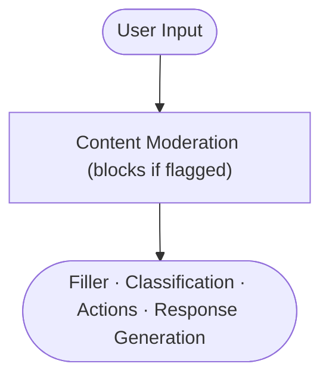
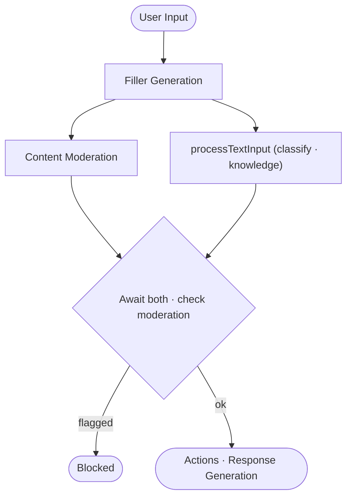

# Content Moderation

Bonsai Backend includes built-in content moderation that screens user input before it reaches the AI pipeline. Moderation can run synchronously (blocking all processing until done) or in parallel with other pipeline steps to reduce latency.

## How Moderation Works

When enabled on a project, moderation calls the configured LLM provider's moderation API, which returns a list of detected content categories. If any detected category matches the project's blocklist, the input is flagged. The point in the pipeline at which moderation resolves depends on the configured [mode](#moderation-mode).

### Strict mode (default)

Moderation runs as the **first step**, before any other LLM call:



### Standard mode

Moderation runs **in parallel with `processTextInput`** (classification/knowledge retrieval), after filler generation. This hides moderation latency behind the classification call, which is typically the longest step:



## Configuration

Moderation is configured via the `moderationConfig` field on the [Project](./projects):

```json
{
  "moderationConfig": {
    "enabled": true,
    "llmProviderId": "openai-provider",
    "blockedCategories": ["hate", "violence", "sexual"]
  }
}
```

| Field | Type | Required | Description |
|---|---|---|---|
| `enabled` | `boolean` | Yes | Whether moderation is active |
| `llmProviderId` | `string` | Yes | ID of the LLM provider to use for moderation |
| `blockedCategories` | `string[]` | No | Provider-specific category names to block. If omitted or empty, **any** flagged category blocks the input. |
| `mode` | `string` | No | Execution mode: `strict` (default) or `standard`. See [Moderation Mode](#moderation-mode). |

## Supported Providers

Only providers that implement content moderation can be used:

| Provider | Supported Categories |
|---|---|
| **OpenAI** | `harassment`, `harassment/threatening`, `hate`, `hate/threatening`, `illicit`, `illicit/violent`, `self-harm`, `self-harm/instructions`, `self-harm/intent`, `sexual`, `sexual/minors`, `violence`, `violence/graphic` |
| **Mistral** | `sexual`, `hate_and_discrimination`, `violence_and_threats`, `dangerous_and_criminal_content`, `selfharm`, `health`, `financial`, `law`, `pii` |

Other LLM providers do not support moderation. Using an unsupported provider will cause moderation to be silently skipped (fail-open behavior).

## Fail-Open Policy

Moderation is designed to **fail open** — if the moderation check fails for any reason, the user input is allowed through. This includes:

- Provider not found in database
- Provider doesn't support moderation
- Network errors or timeouts
- Any unexpected errors

Failures are logged as warnings but never block the conversation.

## What Happens When Content Is Blocked

### With a `__moderation_blocked` Global Action

If a [Global Action](./global-actions) with the reserved ID `__moderation_blocked` is defined on the project:

1. The action's effects are executed (e.g., send a polite refusal message, track violations)
2. The user's original input is recorded as `[Content removed by moderation]` in the conversation history
3. The original text is preserved in the event's `originalText` field for auditing
4. The turn ends — no classification or LLM response generation occurs

### Without a `__moderation_blocked` Global Action

If no `__moderation_blocked` action is defined:

1. The user input is silently replaced with `[Content removed by moderation]`
2. Processing continues normally — the replacement text is sent through classification and LLM response generation
3. The AI responds based on the sanitized input

::: tip
Defining a `__moderation_blocked` global action is recommended for production deployments. It gives you full control over the user experience when content is blocked.
:::

## Blocked Categories

The `blockedCategories` field controls which detected categories cause blocking:

- **Specified**: Only the listed categories cause blocking. Detected but non-listed categories are still reported in events but do not flag the input.
- **Omitted or empty**: Any detected category causes blocking.

```json
// Block only hate and violence, allow other flagged categories through
{
  "blockedCategories": ["hate", "violence"]
}
```

## Moderation Events

When moderation detects categories (even if the input is not ultimately blocked), a `moderation` event is emitted to connected WebSocket clients with `receiveEvents` enabled. This allows real-time monitoring dashboards.

## Moderation Mode

The `mode` field controls when the moderation result is awaited relative to the rest of the pipeline.

| Mode | Behaviour | Use case |
|---|---|---|
| `strict` (default) | Moderation fully resolves **before** filler generation and all LLM calls. | Highest safety guarantee. No user-derived content ever reaches other providers while unflagged. |
| `standard` | Moderation runs **in parallel with `processTextInput`** (after filler). Resolves before classification results are acted upon. | Lower latency — moderation latency is hidden behind the classification call. |

::: warning
In `standard` mode the filler sentence is generated and sent to TTS/the client before moderation completes. If moderation flags the input, the filler may already have been heard by the user. The turn is still aborted correctly — only the short filler audio is affected.
:::

## Performance

- In `strict` mode, moderation latency adds directly to turn latency.
- In `standard` mode, moderation runs in parallel with classification/knowledge retrieval (after filler generation), effectively hiding moderation latency behind the longest pipeline step.
- Duration is tracked in `moderationDurationMs` and included in turn timing metadata.
- Moderation latency is visible in the [Analytics](/api/analytics) endpoints.

## Setting Up Moderation

1. Create or identify an LLM [Provider](./providers) that supports moderation (OpenAI or Mistral)
2. Update the project's `moderationConfig`:
   ```json
   {
     "moderationConfig": {
       "enabled": true,
       "llmProviderId": "your-openai-provider-id",
       "blockedCategories": ["hate", "violence", "sexual", "self-harm"]
     }
   }
   ```
3. Optionally create a `__moderation_blocked` [Global Action](./global-actions) to customize the blocked response
4. Test with sample inputs to verify categories are being detected correctly
