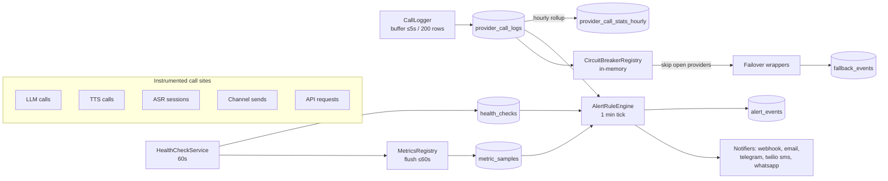

# Monitoring & Alerting (Operator Guide)

Operational guide to the monitoring system shipped on the `advanced-monitoring`
branch: what is observed, how alerts fire and get delivered, how provider
failover works, and what to do when something is wrong.

- **API contract for the Console UI:** see [Monitoring API (frontend)](/guide/monitoring-api)
  (endpoints, params, response shapes, samples).
- **Design history:** `PROPOSAL-production-monitoring.md` + the per-issue specs in
  `.issues/proposal/monitoring/` in the repo root.

## 1. Overview

### What is monitored

| Surface | Source | Where it lands |
|---|---|---|
| Third-party provider calls (LLM, TTS, ASR, storage, channel sends) | instrumented call sites | `provider_call_logs` (rows) + `metric_samples` (aggregates) + `provider_call_stats_hourly` (hourly rollups) |
| Streaming phases (TTFT, chunk gaps, RTF, eos→final) | stream observers | `provider_call_logs.metrics` (jsonb) + histograms in `metric_samples` |
| API request outcomes (status, duration, 429s) | request-outcome middleware | `metric_samples` only (no per-request rows) |
| Database + process + background-service health | `HealthCheckService` (60 s cycle) | `health_checks` + gauges |
| Provider liveness probes (LLM/ASR/TTS) | free "enumerate/ping" endpoints, same cycle | `health_checks` + probe-failure counters |
| Alert state | `AlertRuleEngine` (1 min tick) | `alert_events` (fired + resolved, with notification trail) |
| Failover transitions | failover wrappers + circuit breakers | `fallback_events` + metrics |

### Where the data lives

**All Postgres. No Redis, no Prometheus server, no new infrastructure.** The
in-process `MetricsRegistry` and `CallLogger` are only *buffers*: they flush
deltas to `metric_samples` (≤60 s) and `provider_call_logs` (≤5 s or 200 rows)
and keep no durable state of their own. A process restart loses only the
in-memory window (breaker state, alert anti-flap state) — every durable fact
survives in Postgres.

### Data flow



## 2. Health

### Endpoints

| Endpoint | Auth | Meaning |
|---|---|---|
| `GET /health` | none | Liveness. Always `200` while the process can serve. |
| `GET /health/ready` | none | **Readiness** — DB-backed. `503` if the db check is down; includes the last health snapshot (`checks`, `at`). Point load-balancer / orchestrator readiness probes here. |
| `GET /api/monitoring/health` | `super_admin` | Same snapshot, from the API (for the Console). |

### The check registry

Every cycle (default **60 s**, `MONITORING_HEALTH_INTERVAL_MS`, min 1000 ms)
the `HealthCheckService` runs, in order:

1. **`db`** — pool ping. `ok` when the ping succeeds and no pool client is
   waiting; `degraded` when clients are waiting; `down` on failure. Detail
   carries `poolTotal` / `poolIdle` / `poolWaiting`.
2. **`process`** — RSS, event-loop lag p95/max over the cycle, uptime.
   Publishes the `rss_bytes`, `event_loop_lag_p95_ms`,
   `event_loop_lag_max_ms` gauges.
3. **`service_heartbeat:<name>`** — one check per background service via the
   `HeartbeatRegistry`. Each service stamps a heartbeat on every tick; a check
   is `down` when no tick arrived within **3× the service's tick interval**
   (a stalled or crashed loop). Services with no work yet report `unknown` and
   never fire alerts.
4. **Provider probes** (see below) — one check per configured provider where a
   free liveness endpoint exists.

### Provider probe policy + cost

Probes use **zero-cost or near-zero-cost endpoints only**: LLM →
`enumerateModels()` (or a 1-token generation where no list endpoint exists),
storage → `list`, ASR/TTS → vendor `ping()` endpoints where available.
Providers with no free liveness endpoint (Azure ASR/TTS, Cartesia TTS) fall
back to **inferring** health from recent `provider_call_logs` instead of
probing. Per-type toggles + failure cooldowns live in
`monitoring_config.probeSettings` (`llmProbe` / `asrProbe` / `ttsProbe`).
`MONITORING_HEALTH_PROBES=off` is a **hard environment kill switch** that
overrides any config — use it when a vendor is rate-limiting your probe
traffic.

### Reading the snapshot

```json
{
  "at": "2026-08-21T14:03:00.000Z",
  "checks": [
    { "name": "db", "status": "ok", "detail": { "poolTotal": 10, "poolIdle": 9, "poolWaiting": 0 } },
    { "name": "process", "status": "ok", "detail": { "rssBytes": 216268800, "eventLoopLagP95Ms": 0.8, "uptimeSec": 86400 } },
    { "name": "service_heartbeat:ConversationTimeoutService", "status": "ok" },
    { "name": "provider_probe:prov_openai", "status": "ok", "detail": { "probe": "enumerateModels" } }
  ]
}
```

Statuses: `ok` | `degraded` | `down` | `unknown`. History:
`GET /api/monitoring/health-history?check=<name>&from=...&to=...` (filterable,
paginated, text-searchable on check name + status).

## 3. Alerting

### How an alert becomes an event

The `AlertRuleEngine` ticks every minute (config `alerting.engineIntervalMinutes`,
env override `MONITORING_ALERT_ENGINE_INTERVAL_MS`). Each tick evaluates every
**enabled** rule against a snapshot of health checks, windowed call-log stats,
windowed metric counters, breaker states and recent fallback events.

Rules produce *verdicts* per scope part (global, or one per provider / key).
A verdict that is **met** does not fire immediately — the state machine:

1. **pending → firing** after the condition has held for `forMinutes`
   (sustainment — kills single-tick blips).
2. **firing → resolved** after `resolveAfterGoodChecks` consecutive good
   checks (hysteresis — no flapping on a recovering provider).
3. After resolution, the rule re-arms only after `cooldownMinutes`
   (default 15).
4. `maxUnresolvedHours` (default 6) is a safety valve: an alert that stays
   firing past it is force-resolved (and re-armed) so a stuck condition cannot
   suppress future alerts forever.

Fired and resolved alerts both persist to `alert_events` (with the full
`context` object and the per-notifier delivery trail in `notifications`).
Alerts have an **ack** state (`acknowledgedBy` / `acknowledgedAt`) — acking is
an annotation, it does not change firing/resolution.

### Default rules

All 21 built-in rules. Every default can be overridden per rule in
`monitoring_config.rules` (see [Config](#config-api--env-fallbacks)); disabling
a rule or changing its severity/threshold needs no deploy.

| id | scope | severity | fires when | key defaults |
|---|---|---|---|---|
| `db-down` | global | critical | db check `down` for 2 consecutive cycles | cooldown 15 m |
| `service-stalled` | global | warning | a background-service heartbeat is 3× its tick interval late | for 2 min |
| `db-pool-saturated` | global | warning | pool `waiting/total` > threshold, sustained | 20%, for 5 min |
| `provider-down` | per provider | critical | 100% of calls failed in window (≥ minSamples) **or** breaker OPEN **or** ≥3 consecutive probe failures | window 10 min, minSamples 5, for 2 min |
| `provider-degraded` | per provider | warning | error rate > threshold **or** p95 duration > per-type cap (llm 20 s / asr 2 s / tts 5 s / channel 10 s) | 30%, window 10 min, minSamples 10 |
| `provider-rate-limited` | per provider | warning | ≥ N upstream 429 (`rate_limited`) errors in window — quota, not outage | 5, window 10 min |
| `provider-auth-failed` | per provider | critical | ≥1 auth error in window — credentials misconfigured/expired, **will not self-heal** | window 5 min, for 0 min (no sustainment delay) |
| `api-5xx-spike` | global | warning | Bonsai API 5xx ratio > threshold over ≥ minSamples requests | 5%, window 5 min, minSamples 20 |
| `api-429-spike` | global (scoped to key when one dominates) | warning | Bonsai's own API rate-limit rejections ≥ threshold | 20, window 5 min |
| `auth-429-spike` | global (scoped to key when one dominates) | warning | auth (login/refresh) limiter rejections ≥ threshold — brute force / credential stuffing | 5, window 15 min |
| `oauth-refresh-failing` | per provider | warning | ≥ N OAuth2 token refresh failures in window | 3, window 60 min |
| `imap-poll-failing` | per provider | warning | ≥ N failed IMAP poll cycles in window | 5, window 60 min |
| `high-memory` | global | warning | process RSS > threshold | 1536 MB (`MONITORING_MEMORY_THRESHOLD_MB`), for 2 min |
| `event-loop-lag` | global | warning | event-loop lag p95 > threshold, sustained | 250 ms, for 2 min |
| `fallback-active` | per provider | info | ≥1 failover execution in window — primary is degrading (informational) | window 10 min |
| `provider-chain-exhausted` | per provider | critical | ≥1 full failover-chain exhaustion in window — **every** provider in the chain failed | window 5 min, cooldown 10 min, maxUnresolved 12 h |
| `stream-slow-ttft` | per provider | warning | streaming TTFT p95 > threshold over ≥ minSamples streaming calls | 10 s (TTS fixed 3 s), window 10 min |
| `stream-stalls` | per provider | warning | > threshold fraction of streamed calls had a max chunk gap > 10 s | 10%, window 10 min |
| `stream-abort-rate` | per provider | warning | > threshold fraction of **all** calls aborted mid-stream | 10%, window 10 min |
| `tts-rtf-degraded` | per provider | warning | > threshold fraction of TTS calls had real-time factor > 1 (took longer than the audio produced) | 10%, window 10 min |
| `asr-final-latency` | per provider | warning | ASR eos→final-transcript latency p95 > threshold | 10 s, window 10 min, minSessions 5 |

The live catalog (always in sync with the code) is served at
`GET /api/monitoring/rules` — build UIs from it instead of hardcoding ids.

### Notifiers

Configured in `monitoring_config.notifiers`. Delivery is **at-most-once**
(no retry queue in v1) with a **15 s total cap** per notification batch; every
attempt (success or failure, with `detail`) is recorded in
`alert_events.notifications` so nothing is silently lost from the audit view.

| type | required fields | notes |
|---|---|---|
| `webhook` | `url` (http/s) | `POST` JSON (sample below). One retry on *transport* failure only (DNS/refused/timeout); any HTTP response — even 5xx — is final. |
| `email` | `channelProviderId` + `to` (email) | sends through a configured **email channel provider** (SES / SMTP-IMAP / SendGrid). |
| `telegram` | `channelProviderId` + `chatId` | sends through a configured Telegram channel provider. |
| `twilio_sms` | `channelProviderId` + `to` (E.164) | Twilio Messaging channel provider. |
| `whatsapp` | `channelProviderId` + `to` (E.164) | WhatsApp Graph API channel provider. |

Every notifier also supports `minSeverity` (`info` | `warning` | `critical`)
and `enabled`. Channel-based notifiers reuse the channel providers you already
run for traffic — no separate credentials.

Webhook payload:

```json
{
  "event": "alert_fired",
  "ruleId": "provider-down",
  "severity": "critical",
  "scopeKey": "prov_openai",
  "scope": "per_provider",
  "message": "OpenAI (prov_openai): 100% of 7 calls failed in the last 10 min (top error: timeout) — provider appears down",
  "context": { "providerId": "prov_openai", "calls": 7, "errors": 7, "errorCounts": { "timeout": 7 } },
  "firedAt": "2026-08-21T14:03:11.000Z"
}
```

(`event: "alert_resolved"` adds `resolvedAt`; `context` is rule-specific.)

Alert text layout for the human channels is `header / message / footer`,
truncated to the channel's message limit (Telegram 4096, SMS 320, WhatsApp
4096 characters).

### Config: API + env fallbacks

- **API (source of truth after first boot):** `GET /api/monitoring/config` and
  `PUT /api/monitoring/config` — full replacement with optimistic locking
  (`{ version, config }`; `409` on version mismatch). All `super_admin`.
- **Env fallbacks (seed the *first* config row only):**
  - `MONITORING_WEBHOOK_URL` → a webhook notifier
  - `MONITORING_EMAIL_PROVIDER_ID` + `MONITORING_EMAIL_TO` (both) → an email notifier
  - `MONITORING_RETENTION_DAYS` (integer ≥ 7) → retention
  After the first boot the DB row wins — change notifiers via the API/Console,
  not by restarting with env vars.
- **Rule override shape** (per rule id, all fields optional):
  `{ enabled?, severity?, threshold?, windowMinutes?, minSamples?, forMinutes?, resolveAfterGoodChecks?, cooldownMinutes?, maxUnresolvedHours? }`.
  Unknown rule ids are a **config validation error** (400), not a silent no-op.

## 4. Failover

### Fallback chains

A provider can declare ordered fallbacks on its `providers.fallbacks` JSONB
column — an array of **provider ids of the same type** (llm→llm, tts→tts,
asr→asr, storage→storage). Validation on write rejects: type mismatches,
unknown ids, self-references, and cycles.

Provider API payload example (creating/updating a provider):

```json
{
  "id": "prov_openai",
  "name": "OpenAI (primary)",
  "providerType": "llm",
  "apiType": "openai",
  "config": { "apiKey": "sk-..." },
  "fallbacks": ["prov_anthropic", "prov_mistral"]
}
```

At call time the failover wrappers (`FailoverLlmProvider`,
`FailoverTtsProvider`, `FailoverAsrProvider`, `FailoverStorageProvider`) walk
the chain: primary first, then each fallback whose **circuit breaker is not
open** (open steps are skipped, not retried). Each *actual* failure records a
`fallback_events` row (primary, chosen fallback, reason, operation, success of
the fallback attempt).

### What fails over — and the mid-stream boundary

| Operation | Failover behavior |
|---|---|
| LLM `generate` (non-streaming) | any failure → next step in the chain |
| LLM `generateStream` | **setup-phase** failure (before the first token) → next step. **Mid-stream** failure (tokens already emitted) → **no failover** — re-running a completion that already wrote tokens would corrupt the turn. The error surfaces as today; the call-log row carries `errorPhase: 'mid_stream'` so the mid-stream failure rate is observable (see `stream-abort-rate`). |
| TTS `synthesize` | failure before audio starts → next step |
| ASR session | `start()` failure → next step; a session already streaming is not re-pointed |
| Storage ops | any failure → next step |

When **every** step fails (or is breaker-open), the original error is thrown to
the caller **and** a `provider_chain_exhausted_total` metric is recorded —
which drives the critical `provider-chain-exhausted` alert (the message names
the whole chain).

### Circuit breakers

Per-provider, **in-memory** (`CircuitBreakerRegistry`), fed by every call
outcome:

- **closed → open** after `failureThreshold` qualifying failures inside
  `windowMs` (defaults: 5 failures / 60 s).
- **open → half-open** after `cooldownMs` (default 300 s); the next call is a
  probe — success closes the breaker, failure re-opens it.
- While open, the provider is **skipped** by failover walkers (skips are
  counted in `circuit_open_skips_total`) — no timeout waiting on a dead vendor.
- Settings (`failureThreshold` / `windowMs` / `cooldownMs`) live in
  `monitoring_config.circuitBreaker` and apply **live** (no restart).
- **Restart semantics:** breakers are process-local. A restart resets all of
  them to closed — the first failing calls re-open the circuit within one
  window. Durable history (opens, skips, states) is in metrics + the
  `provider` overview endpoint, not in the registry.

Read breaker state: `GET /api/monitoring/providers` returns `circuitBreaker`
(`state`, `failuresInWindow`, `lastStateChangeAt`, `opensInLast24h`) per
provider — `null` while the process has not seen a call for that provider.

### Not in v1 (deliberately closed)

- **Outbound channel fallback** (retry a failed WhatsApp send on Twilio SMS,
  per request) — spec P3-05, closed: per-request channel choice belongs to the
  caller, not the backend.
- **Webhook dead-letter queue** (capture failed *inbound* webhook payloads for
  operator replay) — spec P4-03, closed: overkill for v1. Failed inbound
  webhook processing still logs + returns 500 (carrier-side retry may or may
  not happen); outbound *alert* webhook delivery attempts are auditable in
  `alert_events.notifications`.

## 5. Streaming metrics

Total duration is a poor streaming signal (inputs are arbitrarily long). The
instrumentation therefore measures **phases**:

| Field (call-log `metrics` jsonb) | Histogram | Meaning |
|---|---|---|
| `ttftMs` | `llm_ttft_ms` | LLM time to first token |
| `maxChunkGapMs` | — (rollup percentile) | largest gap between consecutive stream chunks — the "frozen" feeling; >10 s counts as a **stall** in the hourly rollup (`stalled_count`) |
| `audioDurationMs` / `audioBytesOut` | — | TTS produced audio; **RTF = duration / audioDurationMs** (>1 = slower than real time, counted as `rtf_over_1_count`) |
| `setupMs` | `asr_setup_ms` | ASR session `start()` wall time |
| `timeToFirstPartialMs` | — | ASR time to first partial transcript |
| `eosToFinalMs` | `asr_eos_to_final_ms` | end-of-speech → final transcript — the latency the user actually waits for |
| `ai_turn_ttft_ms` | `ai_turn_ttft_ms` | **Whole-turn** waterfall: user input → first LLM token (includes input processing, context transformation, guardrails — everything before the provider call) |

**Why raw token counts are in the call log, not in metric labels:** labels
must stay low-cardinality (`provider_id`, `operation`, `error_code`, …) or the
`metric_samples` table explodes. `tokensPrompt` / `tokensCompletion` / chunk
counts / finish reason live in `provider_call_logs.metrics` (jsonb) and are
queryable through `GET /api/monitoring/provider-calls`.

**Tuning:** the streaming rules (`stream-slow-ttft`, `stream-stalls`,
`stream-abort-rate`, `tts-rtf-degraded`, `asr-final-latency`) all read the
per-provider 10-minute windows from the rollups; raise `threshold` / lower
`minSamples` via `monitoring_config.rules` when a provider is genuinely slower
but healthy. Compare against the per-type p95 caps used by
`provider-degraded` (llm 20 s / asr 2 s / tts 5 s / channel 10 s) so the two
families of rules don't contradict each other.

## 6. 429 monitoring (three distinct things)

"Rate limited" means three different operational problems — the system keeps
them separate:

| Rule | What it counts | Operational meaning |
|---|---|---|
| `api-429-spike` | Bonsai's **own** API rate limiter (`RATE_LIMIT_API_MAX`, default 300/min per operator) | A noisy/buggy client (misconfigured polling loop, abuse) — or the limit is set too low for legitimate traffic. When one key dominates, the alert **scopes to that key** (hashed — operator ids and IPs are never stored as labels) and the message says so; otherwise it reports the distributed case. |
| `auth-429-spike` | the auth limiter on login/refresh | **Security signal** — brute force / credential stuffing. Same key-scoping; treat as an incident and check recent login traffic. |
| `provider-rate-limited` | **upstream** vendor 429s in `provider_call_logs` (error code `rate_limited`) | **Quota problem, not an outage** — the vendor is reachable but billing/plan limits are hit. Action: raise the vendor quota, add a fallback provider, or throttle usage. Deliberately a separate (warning) rule from `provider-down` (critical) so a quota bump doesn't page like an outage. |

The 429 counters themselves are windowed in-memory deltas
(`rate_limit_rejections_total` by limiter kind + hashed key label) — the
engine never re-scans tables for them.

## 7. API reference

- **Swagger/OpenAPI:** `GET /api-docs` (UI) and `GET /openapi.json` — all
  `/api/monitoring/*` routes, schemas and permissions are documented there.
- **Console-facing contract (endpoint-by-endpoint, with samples and poll
cadences):** [Monitoring API (frontend)](/guide/monitoring-api).
- All `/api/monitoring/*` routes require `system:monitoring` — **super_admin
  only** in v1. Every other role gets 403; gate the Console UI on that role.

### Prometheus scrape (P4-01)

`GET /metrics` (root path, not under `/api`) is a Prometheus text exposition
of the in-memory registry. **Disabled by default** — set
`MONITORING_METRICS_TOKEN` to a long random string to enable; then scrape it
with the token as a bearer/`Authorization` value or the configured token
header (see `src/http/middleware/metricsEndpoint.ts` for the accepted forms).

```yaml
# example scrape_config (bearer style)
- job_name: bonsai
  metrics_path: /metrics
  static_configs: [{ targets: ['bonsai-backend:3000'] }]
  headers:
    Authorization: "Bearer <MONITORING_METRICS_TOKEN>"
```

The endpoint bypasses auth / rate-limit / outcome middleware by design (it is
a scrape target, not an API route): it never burns rate-limit budget and never
appears in `api_requests_total`. History (pre-aggregated buckets over time)
lives in `GET /api/monitoring/metrics?name=...&from=...&to=...&step=...` —
window capped at 14 days.

## 8. Retention & storage

`RetentionService` (cron):

- **Hourly** (`0 * * * *`): rolls the previous hour of `provider_call_logs`
  into `provider_call_stats_hourly` (idempotent — re-running a bucket is a
  no-op). The rollups power the provider overview, `provider-stats` and the
  per-type duration thresholds.
- **Daily at 03:00** (`0 3 * * *`): purges rows older than `retentionDays`
  (default **90 days**) from `provider_call_logs`, `health_checks` and
  `metric_samples`. `provider_call_stats_hourly` is kept for **2×** retention
  (long-term trend line from cheap aggregates).

**Never purged:** `alert_events`, `fallback_events`, `monitoring_config` — the
audit trail is durable by design. `alert_events` growth is bounded by alert
volume, not call volume (one row per fire/resolve, not per call).

Change retention: `monitoring_config.retentionDays` (API) or
`MONITORING_RETENTION_DAYS` before first boot (integer ≥ 7).

### Load sanity (measured 2026-08-21, P4-05)

Scripted burst through the real `CallLogger` (100 conversations × 3 provider
calls — LLM/TTS/ASR — over 60 s) plus a 100× projection with `EXPLAIN
(ANALYZE)` of the exact hourly rollup:

| Measurement | Result |
|---|---|
| Burst throughput | 4.54 rows/s → ~16.4k rows/h → **~392k rows/day (1×)** |
| CallLogger buffer at burst | peak 27 pending (threshold 200, cap 10,000); 11 flushes on the 5 s timer; max inter-flush gap 5.0 s; **0 dropped** |
| 100× projection | ~39.3 M rows/day; one 100× hour bucket = ~1.64 M rows |
| Hourly rollup at 100× (worst case: whole table in-window → seq scan) | **5.37 s**, with disk-spilled sorts |

The pre-agreed decision rule (projected daily rows > 5 M **or** 100× rollup
> 5 s) is **triggered** → follow-up issue filed:
`.issues/medium/provider-call-logs-partitioning.md` (repo root) — time
partitioning + partition-based purge. Until that lands, the practical
revisit trigger is **≈ 100× current call volume (~39 M provider-call rows per
day)**; below that, the indexed single-table design is fine (P4-04's EXPLAIN
evidence: sub-millisecond at 15-min windows, ≤ 4.4 ms per day at 3k rows).

## 9. Operational runbooks

### "A provider is down" (`provider-down`, critical)

1. `GET /api/monitoring/providers` — check `probeStatus` + `circuitBreaker`
   state + 15-min rolling ok-rate. The breaker being OPEN means the system is
   already shedding traffic away from that provider.
2. `GET /api/monitoring/fallback-events?from=...&to=...` (or
   `GET /api/monitoring/alerts` → the alert's `context.failoverChain`) — see
   which fallbacks served and whether they succeeded. If the chain is
   exhausted, you will also have the critical `provider-chain-exhausted`
   alert.
3. `GET /api/monitoring/provider-calls?providerId=...&from=...&to=...` —
   error code distribution: `auth` → fix credentials (the
   `provider-auth-failed` alert names this and will not self-heal);
   `rate_limited` → quota (see [§6](#6-429-monitoring-three-distinct-things));
   `timeout` / `server_error` → vendor-side, check the provider's status page.
4. If you have a fallback provider configured, traffic should already be
   riding it — verify with `fallback-active` (info) alerts / `fallback_events`.
   If not, add `fallbacks` on the provider now (takes effect on the next call).
5. Recovery: the breaker goes half-open after `cooldownMs`, the `provider-down`
   alert auto-resolves after 2 good check cycles, and a `resolved` event lands
   in `alert_events`.

### "I got paged — what does this alert mean?"

- `GET /api/monitoring/alerts?status=firing` — active alerts; each carries
  `message` (human), `context` (machine, rule-specific) and `notifications`
  (per-notifier delivery trail).
- `GET /api/monitoring/alerts?ruleId=...&from=...&to=...` — history for a rule
  (text-searchable on message/scope/rule id).
- **Acknowledge** (annotation only — does not change firing/resolution):
  `POST /api/monitoring/alerts/{id}/ack`.
- Silence a noisy rule without deleting config: `PUT /api/monitoring/config`
  with `rules["<id>"].enabled = false` — or lower `threshold` / raise
  `minSamples`. Rule catalog: `GET /api/monitoring/rules`.

### "Did my alert get delivered?"

`alert_events.notifications` records **every** attempt per notifier:
`{ notifierId, phase: 'fired'|'resolved', ok, detail?, at }`. `ok: false`
rows carry the failure detail (HTTP status, transport error). Delivery is
at-most-once with a 15 s cap (no retry queue in v1 — spec P4-03 was closed),
so a persistent notifier failure means: **fix the notifier config**
(`PUT /api/monitoring/config`), because later alerts will keep failing the
same way. Webhook notifier: transport failures (DNS/refused/timeout) are
retried once automatically; an HTTP response (even 5xx) is final.

### "Bonsai is returning 429 to clients"

`api-429-spike` firing: check whether it's scoped to one key (the alert
message says so and the `scopeKey` is the hashed key — map it back through
`operator` activity in your own logs if you need the identity). If one key
dominates: that client's polling is too aggressive (or abuse) — raise
`RATE_LIMIT_API_MAX` only if the traffic is legitimate. If distributed:
your limit is below real demand — raise `RATE_LIMIT_API_MAX` (env, restart)
or add capacity.

### "The process looks sick" (high-memory / event-loop-lag / service-stalled)

- `GET /api/monitoring/health` — process check detail (RSS, event-loop lag)
  and per-service heartbeat statuses.
- `event-loop-lag` sustained: something is blocking the loop (heavy
  sync/JSON work, GC) — check recent large payloads (10 mb JSON limit), big
  batch endpoints, and the `voice_media_max_frame_gap_ms` histogram for the
  audio path.
- `service-stalled` names the service in the alert (`service` in context) —
  restart the process; heartbeats resume on the next tick. If it stalls again
  after restart, that service's tick is blocked (investigate its log lines —
  they carry the same pino pipeline).
- `high-memory`: RSS > 1536 MB default (tune via `MONITORING_MEMORY_THRESHOLD_MB`
  or the rule's `threshold`). Check `active_conversations` / gauge history and
  whether a leak correlates with a specific route (`api_request_duration_ms`
  by `route_group`).
