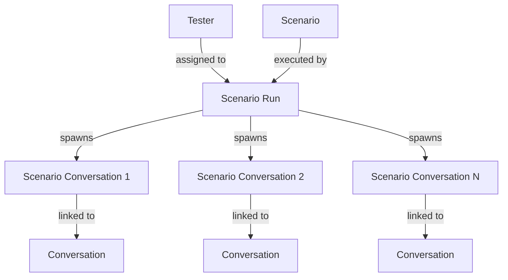

# Automated Testing

Bonsai includes a built-in automated testing framework that lets you verify your agents behave correctly using LLM-powered personas. The system has three core concepts: **Testers**, **Scenarios**, and **Scenario Runs**.

## How It Works



You define reusable **Testers** and **Scenarios** independently, then combine them at runtime via a **Scenario Run**. The system spawns one conversation per tester (or distributes the total across testers), tracks outcomes, and evaluates pass/fail criteria automatically.

## Testers

A **Tester** is an LLM-powered persona that plays the role of the user during an automated conversation. It has a prompt that defines its personality and goals, optional user profile variables, and LLM configuration.

| Field | Description |
|---|---|
| `id` | Unique tester identifier |
| `projectId` | Parent project |
| `name` | Display name |
| `description` | Optional description |
| `prompt` | Prompt defining the tester persona's conversational behaviour |
| `hangUpPrompt` | Mini-prompt evaluated each turn to decide whether the tester should hang up (used when `personaCanHangUp` is enabled on the scenario); must return `true` to continue or `false` to hang up |
| `llmProviderId` | LLM provider used to drive the persona |
| `llmSettings` | Provider-specific LLM settings (model, temperature, etc.) |
| `userProfile` | Key-value profile variables injected when the conversation starts |
| `tags` | Tags for filtering |
| `metadata` | Arbitrary metadata |

The `prompt` should describe who the persona is, their goal, how they speak, and any constraints. The tester reads each AI response and generates the next user message based on this prompt.

The optional `hangUpPrompt` is a short instruction evaluated at the start of each turn. It receives the conversation history and returns `true` (continue) or `false` (hang up). It is only active when the [Scenario](#scenarios) has `personaCanHangUp` enabled.

## Scenarios

A **Scenario** defines the parameters of a test: which stage to start from, how many turns are allowed, how the conversation should end, and what data to extract and validate.

| Field | Description |
|---|---|
| `id` | Unique scenario identifier |
| `projectId` | Parent project |
| `name` | Display name |
| `description` | Optional description |
| `language` | Language code for conversations (e.g. `en`) |
| `startingStageId` | Stage where every test conversation begins |
| `maxTurns` | Maximum allowed turns before the run is marked failed |
| `endingStageIds` | Stage IDs that signal a successful conversation end |
| `conversationOpener` | Optional opening message the tester sends when the first stage awaits user input (defaults to `"[Conversation begins.]"`) |
| `personaCanHangUp` | Whether the tester persona may end the conversation using its `hangUpPrompt` |
| `dataExtraction` | Variables to extract from stages at the end of the conversation |
| `contextTransformerId` | Context transformer run against the final conversation state after the conversation ends |
| `dataPostProcessingExpected` | Expected JSON output of the post-conversation transformer; must match `dataTransformationResults` for the conversation to pass |
| `tags` | Tags for filtering |
| `metadata` | Arbitrary metadata |

### Pass/Fail Criteria

A scenario conversation **passes** when:
- The conversation reaches one of the `endingStageIds` (if defined), or ends via hang-up within the `maxTurns` limit
- All `dataExtraction` entries pass their comparison assertions
- All `dataPostProcessingExpected` entries pass their comparison assertions

A conversation **fails** when:
- `maxTurns` is reached before the conversation ends
- Any comparison assertion fails
- The underlying conversation errors

### Data Extraction

`dataExtraction` is an array of entries that define which variables to read at the end of the conversation:

| Field | Description |
|---|---|
| `stageId` | Stage from which to extract the variable |
| `varName` | Variable name to extract from that stage's variables |
| `expectedValue` | Optional expected value for comparison |
| `expectedMode` | Comparison mode (default: `eq`). See [Comparison Modes](#comparison-modes) for available options. |

This is the primary way to assert that the AI gathered the correct information during the conversation.

### Comparison Modes

Each extraction entry and post-processing expected value supports a comparison mode that controls how the actual result is validated:

| Mode | Description | `expectedValue` type | Example |
|------|-------------|---------------------|---------|
| `eq` | Strict equality (default) | Any | `{ "mode": "eq", "value": 42 }` |
| `exists` | Value is non-null | N/A | `{ "mode": "exists" }` |
| `not_exists` | Value is null/undefined | N/A | `{ "mode": "not_exists" }` |
| `contains` | String contains substring | `string` | `{ "mode": "contains", "value": "error" }` |
| `includes` | Array includes item | Any | `{ "mode": "includes", "value": "admin" }` |
| `matches` | Regex pattern match | `RegExp` | `{ "mode": "matches", "value": /\d{3}-\d{4}/ }` |
| `gt` | Greater than | `number` | `{ "mode": "gt", "value": 0 }` |
| `gte` | Greater than or equal | `number` | `{ "mode": "gte", "value": 0 }` |
| `lt` | Less than | `number` | `{ "mode": "lt", "value": 100 }` |
| `lte` | Less than or equal | `number` | `{ "mode": "lte", "value": 100 }` |
| `in` | Actual value is in expected array | `any[]` | `{ "mode": "in", "value": ["success", "pending"] }` |
| `nin` | Actual value not in expected array | `any[]` | `{ "mode": "nin", "value": ["error", "timeout"] }` |

For `dataExtraction`, the mode is specified via `expectedMode` alongside `expectedValue`. For `dataPostProcessingExpected`, each key maps to an object with `value` and optional `mode`:

```json
{
  "dataExtraction": [
    { "stageId": "collect_phone", "varName": "phone", "expectedValue": "\\d{10}", "expectedMode": "matches" },
    { "stageId": "greeting", "varName": "greeting", "expectedMode": "exists" }
  ],
  "dataPostProcessingExpected": {
    "score": { "value": 5, "mode": "gte" },
    "category": { "value": ["A", "B"], "mode": "in" },
    "debug_info": { "mode": "not_exists" }
  }
}
```

### Post-Conversation Transformer

A scenario can optionally run the final conversation state through a [Context Transformer](/guide/context-transformers) after the conversation ends. This is configured with two fields:

| Field | Description |
|---|---|
| `contextTransformerId` | ID of the transformer to run against the completed conversation state |
| `dataPostProcessingExpected` | Expected values after post-processing — a record mapping keys to `{ value, mode }` objects for comparison |

When the conversation finishes, the engine passes the full conversation context (all stage variables, message history, and metadata) to the specified transformer. The transformer returns a JSON object, which is stored as `dataTransformationResults` on the [Scenario Conversation](#scenario-conversations).

If `dataPostProcessingExpected` is set, each key's result is compared using its configured mode. A mismatch causes the conversation to be marked `failed`. See [Comparison Modes](#comparison-modes) for details on the expected format.

This step is useful when the raw stage variables need normalisation, enrichment, or restructuring before they can be meaningfully asserted — for example, formatting extracted phone numbers, resolving abbreviations, or deriving composite values that span multiple stages.

## Scenario Runs

A **Scenario Run** triggers execution of a scenario using one or more testers. It is the only entity in the testing system that you create at runtime — testers and scenarios are pre-configured.

| Field | Description |
|---|---|
| `id` | Unique run identifier |
| `projectId` | Parent project |
| `scenarioId` | Scenario being executed |
| `testers` | `Record<string, number>` mapping tester IDs to the number of conversations per tester |
| `totalConversations` | Total conversations to execute across all testers |
| `status` | Run status (`queued`, `in_progress`, `passed`, `failed`, `cancelled`, `error`) |
| `statusDetails` | Human-readable details about the current status |
| `errorCount` | Number of conversations that errored during execution |
| `testStatistics` | Object with `passedTests` and `failedTests` totals |
| `metadata` | Arbitrary metadata |

After creation the run starts with status `queued`. The execution engine picks it up, distributes conversations across the assigned testers, and updates the status as work completes.

### Status Lifecycle

Both runs and individual conversations follow the same status progression:

```
queued → in_progress → passed
                    ↘ failed
                    ↘ cancelled
                    ↘ error
```

| Status | Description |
|---|---|
| `queued` | Created, awaiting execution |
| `in_progress` | Currently executing |
| `passed` | All conversations completed and all assertions passed |
| `failed` | One or more conversations failed |
| `cancelled` | Run was cancelled mid-flight |
| `error` | Run encountered an unrecoverable error |

The run's final status rolls up from its conversations: if any conversation fails, the run is marked `failed`.

## Scenario Conversations

Each **Scenario Conversation** represents one individual conversation executed within a run. These are created automatically by the engine — you cannot create them via the API.

| Field | Description |
|---|---|
| `id` | Unique conversation identifier |
| `scenarioRunId` | Parent scenario run |
| `scenarioId` | Scenario being tested |
| `testerId` | Tester used for this conversation |
| `projectId` | Parent project |
| `conversationId` | Linked conversation ID (set once the conversation starts) |
| `status` | Conversation status |
| `testRunStatus` | How the test ended: `conversation_ended`, `conversation_aborted`, `conversation_failed`, `max_turns_reached`, `tester_hung_up` |
| `testStatistics` | Object with `passedTests` and `failedTests` counts |
| `dataExtractionResults` | Variables extracted at conversation end |
| `dataTransformationResults` | Results after any post-processing |

Use the `scenarioRunId` query parameter on the list endpoint to retrieve all conversations belonging to a specific run.

## Common Operations

**Testers**
- Create: `POST /api/projects/:projectId/testers`
- List: `GET /api/projects/:projectId/testers`
- Get: `GET /api/projects/:projectId/testers/:id`
- Update: `PUT /api/projects/:projectId/testers/:id`
- Delete: `DELETE /api/projects/:projectId/testers/:id`

**Scenarios**
- Create: `POST /api/projects/:projectId/scenarios`
- List: `GET /api/projects/:projectId/scenarios`
- Get: `GET /api/projects/:projectId/scenarios/:id`
- Update: `PUT /api/projects/:projectId/scenarios/:id`
- Delete: `DELETE /api/projects/:projectId/scenarios/:id`

**Scenario Runs**
- Create: `POST /api/projects/:projectId/scenario-runs`
- List: `GET /api/projects/:projectId/scenario-runs`
- Get: `GET /api/projects/:projectId/scenario-runs/:id`
- Cancel: `POST /api/projects/:projectId/scenario-runs/:id/cancel`
- Delete: `DELETE /api/projects/:projectId/scenario-runs/:id`
- Scheduler Status: `GET /api/scenario-runs/scheduler`
- Scheduler Toggle: `PUT /api/scenario-runs/scheduler`

**Scenario Conversations**
- List: `GET /api/projects/:projectId/scenario-conversations`
- Get: `GET /api/projects/:projectId/scenario-conversations/:id`

See the [Testers API reference](/api/testers), [Scenarios API reference](/api/scenarios), and [Scenario Runs API reference](/api/scenario-runs) for full request/response details.
