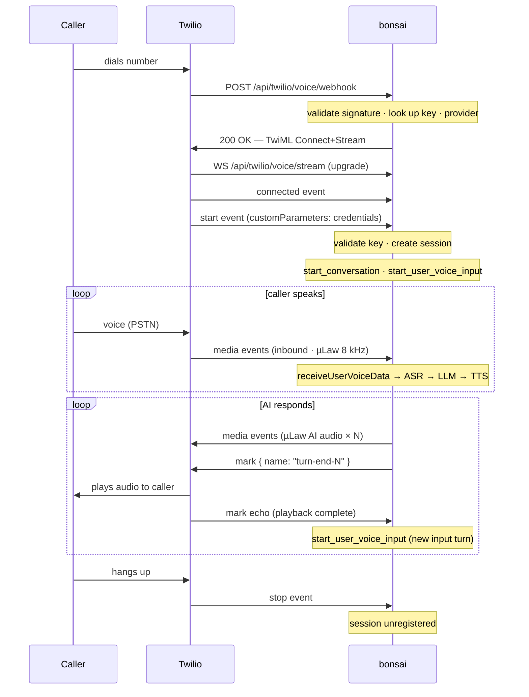
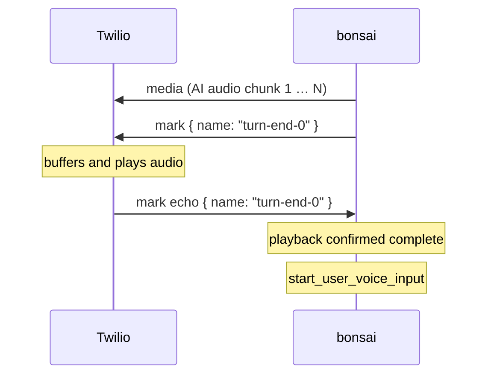
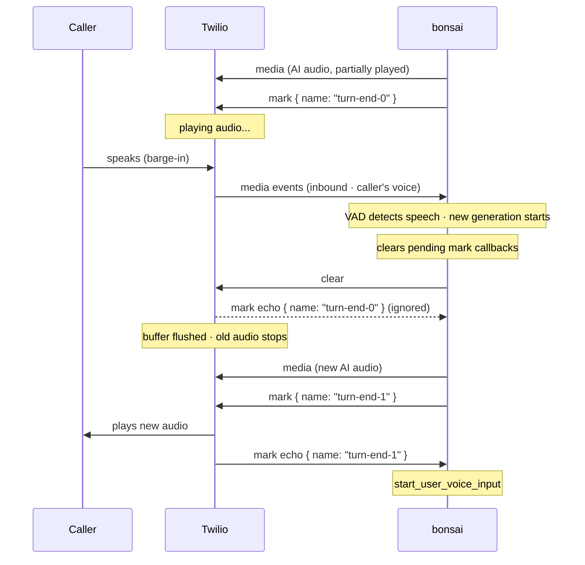

# Twilio Voice Channel

The Twilio Voice channel enables voice-based conversations over inbound PSTN phone calls using [Twilio Media Streams](https://www.twilio.com/docs/voice/media-streams). Audio is streamed bidirectionally in real-time over a WebSocket opened by Twilio directly to the backend — µLaw encoded, 8 kHz sample rate.

This is a **voice-only, server-initiated** channel. There is no browser SDK involved; the caller dials a regular phone number and is connected to the AI agent seamlessly.

## When to Use Twilio Voice

| Scenario | Recommended? |
|---|---|
| Inbound phone call IVR / AI agent | ✅ Yes |
| PSTN caller speaks, AI responds with synthesised voice | ✅ Yes |
| Text-based SMS conversations | ❌ No — use [Twilio Messaging Channel](./twilio-messaging) |
| Browser or mobile app voice | ❌ No — use WebRTC |

## Prerequisites

1. A [Twilio account](https://www.twilio.com/try-twilio) with a voice-capable phone number.
2. A publicly reachable **HTTPS** URL for your backend (Twilio requires HTTPS for webhook validation; the Media Streams WebSocket upgrades from that connection).
3. A project with at least one stage configured, and a TTS provider that can output **µLaw 8 kHz** audio (required by Twilio Media Streams).

## Setup Overview

1. Create a **channel provider** record with your Twilio credentials.
2. Create (or reuse) an **API key** with the `twilio_voice` channel permitted.
3. Configure the Twilio **webhook URL** on your phone number in the Twilio console.
4. Call the number — the AI agent answers.

---

## Step 1: Create a Channel Provider

```http
POST /api/providers
Content-Type: application/json
Authorization: Bearer <operator-token>
```

```json
{
  "name": "My Twilio Voice",
  "providerType": "channel",
  "apiType": "twilio_voice",
  "config": {
    "accountSid": "ACxxxxxxxxxxxxxxxxxxxxxxxxxxxxxxxx",
    "authToken": "your_auth_token",
    "phoneNumber": "+15551234567"
  }
}
```

Save the `id` from the response — you will need it in the webhook URL.

| Config Field | Description |
|---|---|
| `accountSid` | Twilio Account SID (starts with `AC`) |
| `authToken` | Twilio Auth Token — used to validate incoming webhook signatures |
| `phoneNumber` | The Twilio phone number in E.164 format that receives inbound calls |

::: warning Auth Token Security
The `authToken` is stored in the provider `config` field and is readable by operators with `provider:read` permission. Use a dedicated sub-account Auth Token in production and rotate it if compromised.
:::

## Step 2: Create (or Update) an API Key

Ensure the API key permits the `twilio_voice` channel. When `allowedChannels` is `null` (omitted), all channels are allowed.

```http
POST /api/api-keys
Content-Type: application/json
Authorization: Bearer <operator-token>
```

```json
{
  "projectId": "your-project-id",
  "name": "Twilio Voice key",
  "allowedChannels": ["twilio_voice"],
  "allowedFeatures": ["conversation_control", "voice_input", "voice_output"]
}
```

Save the `key` value from the response.

## Step 3: Configure the Twilio Webhook URL

In the [Twilio console](https://console.twilio.com), navigate to your phone number's voice configuration and set the **"A call comes in"** webhook to:

```
POST https://your-backend.example.com/api/twilio/voice/webhook?apiKey=<key>&stageId=<stage-id>&channelProviderId=<provider-id>
```

### Query Parameters

| Parameter | Required | Description |
|---|---|---|
| `apiKey` | Yes | The API key value from Step 2 |
| `stageId` | Yes | The stage ID to start new conversations at |
| `channelProviderId` | Yes | The provider `id` from Step 1 |
| `agentId` | No | Optional agent ID override for conversation start |

::: tip One URL Per Stage
You can point multiple Twilio numbers at different webhook URLs with different `stageId` values to run independent conversation flows from a single backend instance.
:::

---

## How It Works

### Call Flow



### Audio Format

Twilio Media Streams use **µLaw (G.711) encoding at 8 kHz, mono**. Your project's TTS provider must be configured to produce µLaw 8 kHz output. Non-µLaw audio chunks from the TTS pipeline are logged and dropped to prevent distorted audio.

### Credential Delivery via TwiML Parameters

The webhook embeds credentials (`apiKey`, `stageId`, `channelProviderId`, `from`) as `<Parameter>` child elements inside the `<Stream>` TwiML verb rather than as URL query parameters. Twilio delivers these in the WebSocket `start` event's `customParameters` object. This is proxy-safe — reverse proxies commonly strip query strings from WebSocket upgrade requests.

### Voice Input Turn Management

The channel maintains a single open **voice input turn** for the duration of the call:

- On `start` event: a `start_user_voice_input` is dispatched to open the first turn.
- All incoming `media` frames are forwarded to the conversation runner continuously.
- Server-side VAD (Voice Activity Detection) detects when the caller finishes speaking and triggers ASR + LLM inference.
- When the AI finishes speaking, a new `start_user_voice_input` is dispatched **only after Twilio confirms playback is complete** — using the mark synchronisation protocol described below.

### Playback Synchronisation with Marks

To avoid opening a new voice input turn while Twilio is still playing buffered AI audio, the server uses Twilio's mark protocol:



After sending the final audio chunk (`end_ai_generation_output`), the server sends a `mark` message to Twilio. Twilio echoes the mark back only once all buffered audio has finished playing. The server listens for that echo before opening the next input turn.

### Barge-in / Audio Interruption

When the caller interrupts the AI mid-response (barge-in), the server-side VAD detects the caller's speech and a new AI generation turn begins. At that point the server must flush Twilio's audio buffer so the old AI audio stops immediately:



The pending mark callbacks are cleared *before* sending `clear` so that the echoed marks Twilio sends back (in response to the buffer flush) are not mistakenly processed as turn-end signals.

---

## Session Lifecycle

| Event | Behaviour |
|---|---|
| Twilio opens WebSocket (`start` event) | Session created; `start_conversation` dispatched with `userId = caller phone`; voice input turn opened |
| `media` event | µLaw audio forwarded to `session.runner.receiveUserVoiceData()` |
| AI finishes speaking | New voice input turn opened after Twilio confirms audio playback complete (mark echo) |
| Caller interrupts AI (barge-in) | Audio buffer cleared via `clear`; stale mark echoes ignored; new turn begins |
| Caller hangs up (`stop` event) | Session unregistered and cleaned up |
| WebSocket closed unexpectedly | Session unregistered and cleaned up |

---

## Limitations

| Feature | Supported |
|---|---|
| Voice input / output | ✅ |
| Text input / output | ❌ |
| Commands (go-to-stage, set-var, etc.) | ❌ |
| Events (conversation_event push) | ❌ |
| Transcription updates delivered to caller | ❌ |
| Twilio request signature validation | ✅ |
| Outbound calls (calling a number) | ❌ (inbound only) |
| Barge-in / interruption | ✅ — audio buffer cleared via `clear`; mark echoes discarded |

## Security

Every inbound HTTP webhook is validated using the **Twilio request signature**. Requests with a missing or invalid `X-Twilio-Signature` header are rejected with `403 Forbidden`.

The Media Streams WebSocket validates the **credentials** from the `start.customParameters` (set via `<Parameter>` TwiML elements) and verifies the **Account SID** from the `start` event against the configured provider credentials. A mismatch closes the WebSocket immediately.
