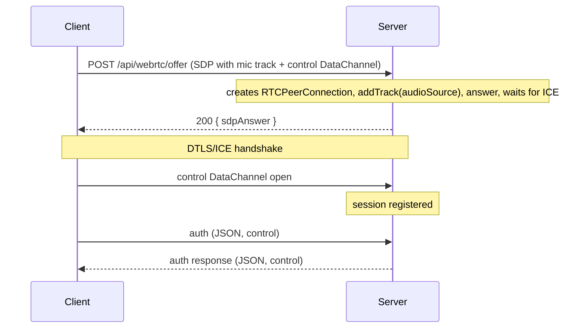
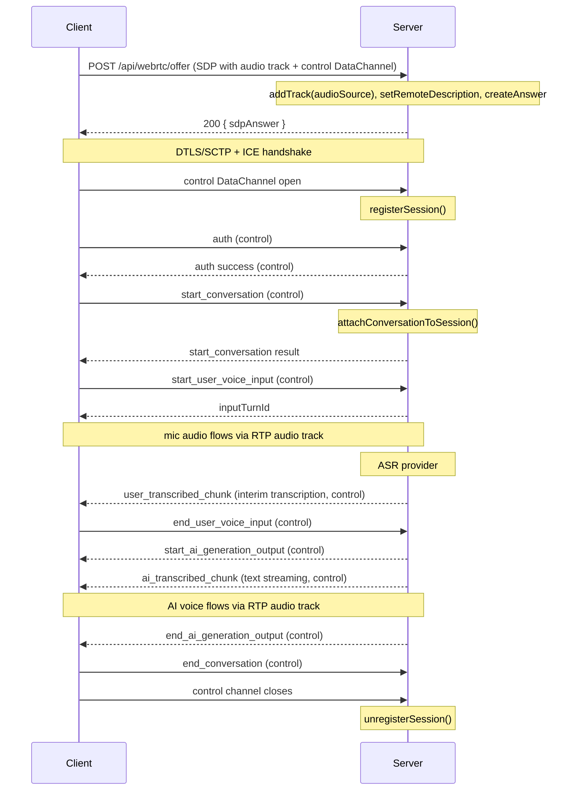

# WebRTC Channel

The WebRTC channel provides real-time bidirectional communication for live conversation sessions using a native WebRTC audio media track for voice and an RTCDataChannel for control messages. It offers lower audio latency than the WebSocket channel by using RTP/SRTP transport and native browser audio APIs instead of base64-encoded JSON.

## When to Use WebRTC vs WebSocket

| Consideration | WebSocket | WebRTC |
|---|---|---|
| Audio voice input/output | base64-encoded JSON | native RTP/SRTP + Opus (no encoding overhead) |
| Control messages (auth, commands) | JSON over TCP | JSON over SCTP DataChannel (same semantics) |
| Connection setup | Single HTTP upgrade | HTTP signaling + DTLS/ICE handshake |
| Browser native audio | Manual encoding required | `getUserMedia()` + `addTrack()` directly |
| Network compatibility | Works everywhere | May fail with symmetric NAT (STUN only) |
| Audio latency | Good | Better |

Use **WebRTC** when audio latency matters — for example voice-first assistants where you are streaming microphone audio. Use **WebSocket** when you need maximum compatibility (corporate proxies, restrictive firewalls) or for text-only use cases.

Both channels are available simultaneously. The conversation protocol (message types, session lifecycle, commands) is identical between them.

## Architecture

The client creates one named RTCDataChannel and adds its microphone audio track before generating the SDP offer:

- **`control`** — ordered, reliable. Carries all JSON messages: auth, session lifecycle, user text input, commands, and server push events. Same protocol as WebSocket.
- **Audio media track** — bidirectional RTP/SRTP (Opus codec). The client sends microphone audio via `addTrack()` / `getUserMedia()`; the server sends AI voice output back via the same negotiated transceiver.

All other messages (transcription updates, generation events, commands, errors) travel as JSON over the `control` channel — identical to WebSocket wire format.

## Signaling

WebRTC connection setup follows a gather-and-return model: the server collects all ICE candidates before returning the SDP answer, so the client receives a complete answer in a single HTTP response with no trickle ICE callbacks needed.



## Connection Setup

Create the `control` DataChannel, attach the microphone audio track, generate a SDP offer, exchange it with the server, then set the answer. The server's outbound audio track arrives in `pc.ontrack`.

```javascript
const pc = new RTCPeerConnection();

// Add the microphone track BEFORE generating the offer so it is
// included in the SDP and the server can answer with its own audio track.
const stream = await navigator.mediaDevices.getUserMedia({ audio: true });
stream.getAudioTracks().forEach((track) => pc.addTrack(track, stream));

// Create the control DataChannel BEFORE generating the offer.
const controlChannel = pc.createDataChannel('control', {
  ordered: true,
});

// Receive the server's outbound audio track (AI voice output).
const remoteStream = new MediaStream();
const audioEl = document.getElementById('ai-audio'); // <audio autoplay>
audioEl.srcObject = remoteStream;

pc.ontrack = (event) => {
  event.streams[0]?.getTracks().forEach((track) => remoteStream.addTrack(track));
};

controlChannel.onopen = () => {
  // Authenticate immediately after the control channel opens.
  controlChannel.send(JSON.stringify({
    requestId: 'req-1',
    type: 'auth',
    apiKey: 'your-project-api-key',
    sessionSettings: {
      sendVoiceInput: true,
      sendTextInput: true,
      receiveVoiceOutput: true,
      receiveTranscriptionUpdates: true,
      receiveEvents: true,
    },
  }));
};

controlChannel.onmessage = (event) => {
  const msg = JSON.parse(event.data);
  handleControlMessage(msg);
};

// Create offer and send to server.
const offer = await pc.createOffer();
await pc.setLocalDescription(offer);

const response = await fetch('/api/webrtc/offer', {
  method: 'POST',
  headers: { 'Content-Type': 'application/json' },
  body: JSON.stringify({ sdpOffer: offer.sdp }),
});

const { sdpAnswer } = await response.json();
await pc.setRemoteDescription({ type: 'answer', sdp: sdpAnswer });
```

## Authentication

After the `control` DataChannel opens, send an `auth` message over it. The format is identical to WebSocket:

```json
{
  "requestId": "req-1",
  "type": "auth",
  "apiKey": "your-project-api-key",
  "sessionSettings": {
    "sendVoiceInput": true,
    "sendTextInput": true,
    "receiveVoiceOutput": true,
    "receiveTranscriptionUpdates": true,
    "receiveEvents": true
  }
}
```

The server responds:

```json
{
  "type": "auth",
  "requestId": "req-1",
  "success": true,
  "sessionId": "session-uuid",
  "projectSettings": {
    "projectId": "my-project",
    "acceptVoice": true,
    "generateVoice": true,
    "asrConfig": null
  }
}
```

Save the `sessionId` — attach it to every subsequent message.

Authentication is rate-limited to **10 attempts per 15 minutes per IP** (same as WebSocket). Exceeding the limit closes the DataChannels.

## Session Settings

All fields default to `true` if omitted.

| Field | Description |
|---|---|
| `sendVoiceInput` | Client will send voice audio frames on the audio channel |
| `sendTextInput` | Client will send text input messages |
| `receiveVoiceOutput` | Server sends AI voice frames on the audio channel |
| `receiveTranscriptionUpdates` | Server sends interim transcription chunks over the control channel |
| `receiveEvents` | Server sends conversation event messages over the control channel |

## Conversation Lifecycle

All lifecycle messages are JSON sent over the `control` channel. The format is identical to WebSocket — only `sessionId` is included instead of it being derived from the WebSocket connection.

### Start Conversation

**Client → Server (control channel):**
```json
{
  "requestId": "req-2",
  "type": "start_conversation",
  "sessionId": "session-uuid",
  "userId": "user-123",
  "stageId": "greeting",
  "timezone": "Europe/Warsaw"
}
```

**Server → Client (control channel):**
```json
{
  "requestId": "req-2",
  "type": "start_conversation",
  "sessionId": "session-uuid",
  "conversationId": "conv-uuid",
  "success": true
}
```

### Resume Conversation

```json
{
  "requestId": "req-3",
  "type": "resume_conversation",
  "sessionId": "session-uuid",
  "conversationId": "conv-uuid"
}
```

### End Conversation

```json
{
  "requestId": "req-4",
  "type": "end_conversation",
  "sessionId": "session-uuid",
  "conversationId": "conv-uuid"
}
```

## User Input

### Text Input

Send over the `control` channel:

```json
{
  "requestId": "req-5",
  "type": "send_user_text_input",
  "sessionId": "session-uuid",
  "conversationId": "conv-uuid",
  "text": "Hello, I need help with my order"
}
```

### Voice Input

Voice input uses the `control` channel for signaling. The audio itself flows automatically over the native audio media track that was set up during connection (via `getUserMedia()` and `addTrack()`). The server captures it through an RTCAudioSink and routes it to ASR.

**1. Signal start (control channel):**

```json
{
  "requestId": "req-6",
  "type": "start_user_voice_input",
  "sessionId": "session-uuid",
  "conversationId": "conv-uuid"
}
```

The server responds with `inputTurnId`:

```json
{
  "requestId": "req-6",
  "type": "start_user_voice_input",
  "sessionId": "session-uuid",
  "success": true,
  "inputTurnId": "turn-uuid"
}
```

Microphone audio is already streaming to the server via the audio media track established during connection setup. No separate audio transmission step is needed — just signal start and end.

**2. Signal end (control channel):**

```json
{
  "requestId": "req-7",
  "type": "end_user_voice_input",
  "sessionId": "session-uuid",
  "conversationId": "conv-uuid",
  "inputTurnId": "turn-uuid"
}
```

### Transcription Updates (Server Push, control channel)

When `receiveTranscriptionUpdates` is enabled:

```json
{
  "type": "user_transcribed_chunk",
  "sessionId": "session-uuid",
  "conversationId": "conv-uuid",
  "inputTurnId": "turn-uuid",
  "chunkId": "chunk-uuid",
  "chunkText": "Hello, I need",
  "ordinal": 1,
  "isFinal": false
}
```

## AI Voice Output

AI voice audio arrives on the native audio media track received via `pc.ontrack` during connection setup. No extra decoding is needed — attach the stream to an `<audio>` element or a Web Audio API node and the browser plays it automatically.

```javascript
// Set up during connection (see Connection Setup above)
const remoteStream = new MediaStream();
const audioEl = document.getElementById('ai-audio'); // <audio autoplay>
audioEl.srcObject = remoteStream;

pc.ontrack = (event) => {
  event.streams[0]?.getTracks().forEach((track) => remoteStream.addTrack(track));
};
```

The `control` channel carries the surrounding generation events so you can show text streaming or react to turn boundaries:

```json
{ "type": "start_ai_generation_output", "outputTurnId": "out-uuid", "expectVoice": true }
```
```json
{ "type": "ai_transcribed_chunk", "outputTurnId": "out-uuid", "chunkText": "Hello!", "ordinal": 1 }
```
```json
{ "type": "end_ai_generation_output", "outputTurnId": "out-uuid", "fullText": "Hello! ..." }
```

## Client Commands

All commands are JSON sent over the `control` channel. Formats are identical to WebSocket.

### Go to Stage

```json
{
  "requestId": "req-8",
  "type": "go_to_stage",
  "sessionId": "session-uuid",
  "conversationId": "conv-uuid",
  "stageId": "troubleshooting"
}
```

### Set / Get Variable

```json
{
  "requestId": "req-9",
  "type": "set_var",
  "sessionId": "session-uuid",
  "conversationId": "conv-uuid",
  "stageId": "current-stage",
  "variableName": "selectedProduct",
  "variableValue": "Widget Pro"
}
```

```json
{
  "requestId": "req-10",
  "type": "get_var",
  "sessionId": "session-uuid",
  "conversationId": "conv-uuid",
  "stageId": "current-stage",
  "variableName": "selectedProduct"
}
```

### Run Action / Call Tool

```json
{
  "requestId": "req-11",
  "type": "run_action",
  "sessionId": "session-uuid",
  "conversationId": "conv-uuid",
  "actionName": "check-order-status",
  "parameters": { "orderId": "ORD-123" }
}
```

```json
{
  "requestId": "req-12",
  "type": "call_tool",
  "sessionId": "session-uuid",
  "conversationId": "conv-uuid",
  "toolId": "translate",
  "parameters": { "text": "Hello", "language": "es" }
}
```

## Error Handling

Errors are sent as JSON over the `control` channel:

```json
{
  "type": "error",
  "requestId": "req-5",
  "error": "No active conversation in this session"
}
```

## Environment Variables

| Variable | Default | Description |
|---|---|---|
| `WEBRTC_ICE_GATHERING_TIMEOUT_MS` | `5000` | Maximum milliseconds to wait for ICE candidate gathering before returning the SDP answer |
| `WEBRTC_STUN_URL` | `stun:stun.l.google.com:19302` | STUN server URL used for ICE gathering |

## Connection Lifecycle Diagram


