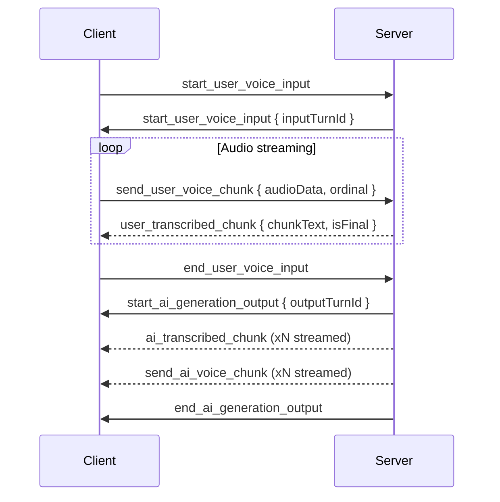
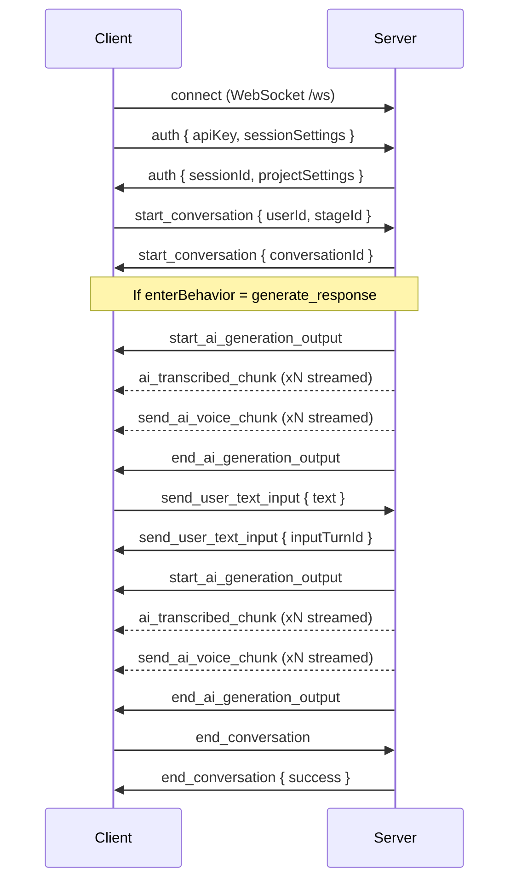

# WebSocket Protocol

The WebSocket API provides real-time bidirectional communication for live conversations. Clients connect, authenticate, and exchange messages for conversation management, user input, and AI responses.

## Connection

Connect to the WebSocket endpoint:

```
ws://localhost:3000/ws
```

## Authentication

After connecting, the client must authenticate with an API key:

**Client → Server:**
```json
{
  "requestId": "req-1",
  "type": "auth",
  "apiKey": "your-project-api-key",
  "sessionSettings": {
    "sendVoiceInput": true,
    "sendTextInput": true,
    "receiveVoiceOutput": true,
    "receiveTranscriptionUpdates": true,
    "receiveEvents": false
  }
}
```

**Server → Client:**
```json
{
  "requestId": "req-1",
  "type": "auth",
  "sessionId": "session-uuid",
  "projectSettings": {
    "projectId": "my-project",
    "acceptVoice": true,
    "generateVoice": true,
    "asrConfig": { ... }
  }
}
```

### Session Settings

| Setting | Default | Description |
|---|---|---|
| `sendVoiceInput` | `true` | Client will send voice audio |
| `sendTextInput` | `true` | Client will send text messages |
| `receiveVoiceOutput` | `true` | Client wants TTS audio chunks |
| `receiveTranscriptionUpdates` | `true` | Client wants intermediate transcription chunks |
| `receiveEvents` | `true` | Client wants raw conversation event broadcasts |

## Message Format

All messages follow this structure:

**Client → Server:**
```json
{
  "requestId": "unique-id",
  "type": "message_type",
  "sessionId": "session-id",
  ...payload
}
```

**Server → Client:**
```json
{
  "requestId": "original-request-id",
  "type": "message_type",
  "sessionId": "session-id",
  ...payload
}
```

## Conversation Lifecycle

### Start Conversation

**Client → Server:**
```json
{
  "requestId": "req-2",
  "type": "start_conversation",
  "sessionId": "session-uuid",
  "userId": "user-123",
  "stageId": "greeting",
  "timezone": "America/New_York"
}
```

| Field | Required | Description |
|---|---|---|
| `userId` | Yes | User initiating the conversation |
| `stageId` | Yes | Stage to start at |
| `agentId` | No | Override the default agent |
| `timezone` | No | IANA timezone identifier (e.g. `America/New_York`). Takes highest precedence in the timezone resolution chain: `start_conversation.timezone` → `userProfile.timezone` → `project.timezone` → UTC. Persisted for the lifetime of the conversation so resume works correctly. |

**Server → Client:**
```json
{
  "requestId": "req-2",
  "type": "start_conversation",
  "sessionId": "session-uuid",
  "conversationId": "conv-uuid"
}
```

### Resume Conversation

**Client → Server:**
```json
{
  "requestId": "req-3",
  "type": "resume_conversation",
  "sessionId": "session-uuid",
  "conversationId": "conv-uuid"
}
```

### End Conversation

**Client → Server:**
```json
{
  "requestId": "req-4",
  "type": "end_conversation",
  "sessionId": "session-uuid",
  "conversationId": "conv-uuid"
}
```

## User Input

### Text Input

**Client → Server:**
```json
{
  "requestId": "req-5",
  "type": "send_user_text_input",
  "sessionId": "session-uuid",
  "conversationId": "conv-uuid",
  "text": "Hello, I need help with my order"
}
```

**Server → Client:**
```json
{
  "requestId": "req-5",
  "type": "send_user_text_input",
  "sessionId": "session-uuid",
  "inputTurnId": "turn-uuid"
}
```

### Voice Input

Voice input uses a three-step streaming protocol:

**1. Start voice stream:**
```json
{
  "requestId": "req-6",
  "type": "start_user_voice_input",
  "sessionId": "session-uuid",
  "conversationId": "conv-uuid"
}
```

**2. Send audio chunks (repeated):**
```json
{
  "type": "send_user_voice_chunk",
  "sessionId": "session-uuid",
  "conversationId": "conv-uuid",
  "inputTurnId": "turn-uuid",
  "audioData": "<base64-encoded-audio>",
  "ordinal": 1
}
```

**3. End voice stream:**
```json
{
  "type": "end_user_voice_input",
  "sessionId": "session-uuid",
  "conversationId": "conv-uuid",
  "inputTurnId": "turn-uuid"
}
```



### ASR Transcription Updates

When `receiveTranscriptionUpdates` is enabled, the server sends interim and final transcriptions:

```json
{
  "type": "user_transcribed_chunk",
  "sessionId": "session-uuid",
  "conversationId": "conv-uuid",
  "inputTurnId": "turn-uuid",
  "chunkId": "chunk-uuid",
  "chunkText": "Hello, I need",
  "ordinal": 1,
  "isFinal": false
}
```

## AI Responses

AI responses are streamed as a sequence of messages:

### 1. Start Generation

```json
{
  "type": "start_ai_generation_output",
  "sessionId": "session-uuid",
  "conversationId": "conv-uuid",
  "outputTurnId": "turn-uuid",
  "expectVoice": true
}
```

### 2. Text Chunks (streamed)

```json
{
  "type": "ai_transcribed_chunk",
  "sessionId": "session-uuid",
  "conversationId": "conv-uuid",
  "outputTurnId": "turn-uuid",
  "chunkId": "chunk-uuid",
  "chunkText": "I'd be happy to help",
  "ordinal": 1,
  "isFinal": false
}
```

### 3. Voice Chunks (streamed, if voice enabled)

```json
{
  "type": "send_ai_voice_chunk",
  "sessionId": "session-uuid",
  "conversationId": "conv-uuid",
  "outputTurnId": "turn-uuid",
  "audioData": "<base64-encoded-audio>",
  "audioFormat": "mp3",
  "sampleRate": 44100,
  "ordinal": 1,
  "isFinal": false
}
```

### 4. End Generation

```json
{
  "type": "end_ai_generation_output",
  "sessionId": "session-uuid",
  "conversationId": "conv-uuid",
  "outputTurnId": "turn-uuid",
  "fullText": "I'd be happy to help you with your order. Can you give me your order number?"
}
```

### Image and Audio Outputs

For multimodal responses:

```json
{
  "type": "send_ai_image_output",
  "sessionId": "session-uuid",
  "conversationId": "conv-uuid",
  "outputTurnId": "turn-uuid",
  "imageData": "<base64-encoded-image>",
  "mimeType": "image/png",
  "sequenceNumber": 1
}
```

## Client Commands

Clients can send commands to control the conversation:

### Go to Stage

```json
{
  "requestId": "req-7",
  "type": "go_to_stage",
  "sessionId": "session-uuid",
  "conversationId": "conv-uuid",
  "stageId": "troubleshooting"
}
```

### Set Variable

```json
{
  "requestId": "req-8",
  "type": "set_var",
  "sessionId": "session-uuid",
  "conversationId": "conv-uuid",
  "stageId": "current-stage",
  "variableName": "selectedProduct",
  "variableValue": "Widget Pro"
}
```

### Get Variable

```json
{
  "requestId": "req-9",
  "type": "get_var",
  "sessionId": "session-uuid",
  "conversationId": "conv-uuid",
  "stageId": "current-stage",
  "variableName": "selectedProduct"
}
```

### Get All Variables

```json
{
  "requestId": "req-10",
  "type": "get_all_vars",
  "sessionId": "session-uuid",
  "conversationId": "conv-uuid",
  "stageId": "current-stage"
}
```

### Run Action

```json
{
  "requestId": "req-11",
  "type": "run_action",
  "sessionId": "session-uuid",
  "conversationId": "conv-uuid",
  "actionName": "check-order-status",
  "parameters": { "orderId": "ORD-123" }
}
```

### Call Tool

```json
{
  "requestId": "req-12",
  "type": "call_tool",
  "sessionId": "session-uuid",
  "conversationId": "conv-uuid",
  "toolId": "translate",
  "parameters": { "text": "Hello", "language": "es" }
}
```

## Event Broadcasting

When `receiveEvents` is enabled in session settings, the server broadcasts conversation events:

```json
{
  "type": "conversation_event",
  "sessionId": "session-uuid",
  "conversationId": "conv-uuid",
  "eventType": "classification",
  "eventData": {
    "classifierId": "default-classifier",
    "input": "I need help with returns",
    "actions": [{ "name": "handle_return", "parameters": {} }]
  }
}
```

See [Conversations](./conversations) for all event types.

## Error Handling

Errors are returned with a standard structure:

```json
{
  "requestId": "req-5",
  "type": "error",
  "sessionId": "session-uuid",
  "error": {
    "code": "INVALID_STATE",
    "message": "Cannot send input while generating response"
  }
}
```

## Connection Flow Summary


